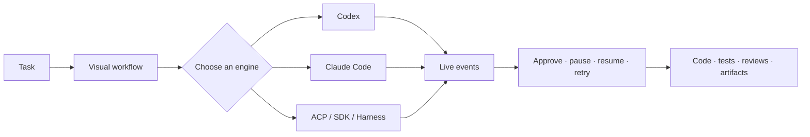

<div align="center">


# WorkStep

### Orchestrate AI coding agents into observable, controllable workflows

WorkStep connects Codex, Claude Code, ACP agents, SDKs, and local harnesses in one visual workspace for planning, implementation, testing, review, and delivery.

[Website](https://xzregg.github.io/workstep/) · [Download](https://github.com/xzregg/workstep/releases/latest) · [Documentation](docs/README.md) · [简体中文](README.zh-CN.md)

[](https://github.com/xzregg/workstep/actions/workflows/ci.yml)
[](https://github.com/xzregg/workstep/releases/latest)
[](LICENSE)


</div>

## Understand WorkStep in 30 seconds



**WorkStep is not another chat UI.** It turns one-off agent conversations into reusable engineering workflows whose progress, tool calls, approvals, context, and outputs remain visible.

## Core capabilities

| | Capability | What it gives you |
|---|---|---|
| 🎛️ | **Visual orchestration** | Build sequential, parallel, review, and rework stages on a reusable workflow canvas. |
| 🤖 | **Multiple agent engines** | Use CLI, SDK, ACP, and harness-based engines without redesigning the workflow around one vendor. |
| 👁️ | **Live observability** | Follow streaming responses, tool calls, execution state, structured events, and step history. |
| 🛡️ | **Human control** | Approve sensitive tools, pause or stop work, resume sessions, and retry failed stages. |
| 💾 | **Local-first storage** | Keep each project's SQLite database, event logs, templates, and artifacts with the project owner. |
| 🔁 | **Recoverable context** | Continue tasks and supported engine sessions after interruption or restart. |
| 📦 | **Web and desktop** | Run from source or use unsigned early-access packages for macOS Apple Silicon, Windows x64, and Linux x64. |
| 🔗 | **Controlled collaboration** | Authorize remote access per project and device instead of uploading every project to a central service. |

## Engines, one workflow model

WorkStep currently integrates engines including:

`Codex CLI` · `Codex SDK` · `Claude Code` · `Claude Agent SDK` · `OpenCode` · `OpenClaw` · `Hermes ACP` · `Cursor SDK` · `Qoder SDK` · `DeepSeek Harness` · `Pydantic AI`

Engine discovery, sessions, approvals, capabilities, and events share a common boundary. Unsupported native capabilities are declared and degraded explicitly rather than simulated.

## See it in action

The [WorkStep website](https://xzregg.github.io/workstep/) contains an interactive product tour of the project workspace, workflow canvas, parallel execution, review gates, and engine switching.

## Get started

### Download the desktop app

The latest release provides:

-  **macOS Apple Silicon** — DMG and ZIP
- 🪟 **Windows x64** — NSIS installer
- 🐧 **Linux x64** — AppImage

Download packages, update metadata, SHA-256 checksums, and the dependency SBOM from [GitHub Releases](https://github.com/xzregg/workstep/releases/latest).

> [!IMPORTANT]
> Desktop packages are currently unsigned early-access builds. Windows SmartScreen or macOS Gatekeeper may show a first-run warning.

### Run from source

Requirements: Python 3.11+, [uv](https://docs.astral.sh/uv/), Node.js 20 or 22, and Yarn through Corepack or an existing installation.

```bash
git clone https://github.com/xzregg/workstep.git
cd workstep
./start.sh
```

Open `http://127.0.0.1:5173`. The local daemon API listens on port `8765` by default. See the [development guide](docs/development.md) for individual application commands and tests.

## Local-first by design

1. Each project owns its `.workstep/` database, event logs, templates, and artifacts.
2. Engines execute through the local daemon; WorkStep does not silently copy projects into a hosted workspace.
3. Optional remote access is explicit, scoped to a project and device, and can be revoked by the project owner.

Local-first describes where WorkStep stores and orchestrates project data. External model providers and optional engines still follow their own network and data policies.

## Documentation

- [Product overview](docs/overview.md)
- [Architecture and data flow](docs/architecture.md)
- [Workflow execution](docs/workflow-engine-execution.md)
- [LLM engine development](docs/llm-engine-development-guide.md)
- [Desktop sandbox mode](docs/desktop-sandbox.md)
- [Development guide](docs/development.md)
- [Security policy](SECURITY.md)

## Community and contributing

Read [CONTRIBUTING.md](CONTRIBUTING.md) before opening a pull request. Use [Issues](https://github.com/xzregg/workstep/issues) for reproducible bugs and actionable feature requests, and [Discussions](https://github.com/xzregg/workstep/discussions) for questions, ideas, and design exploration. Report security issues privately as described in [SECURITY.md](SECURITY.md).

## License

WorkStep is licensed under the [Apache License 2.0](LICENSE). Optional third-party engines and services remain under their own terms; see [THIRD_PARTY_NOTICES.md](THIRD_PARTY_NOTICES.md).
