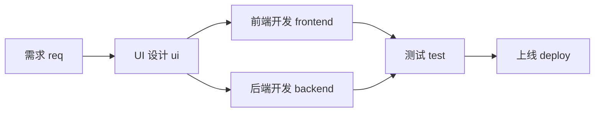
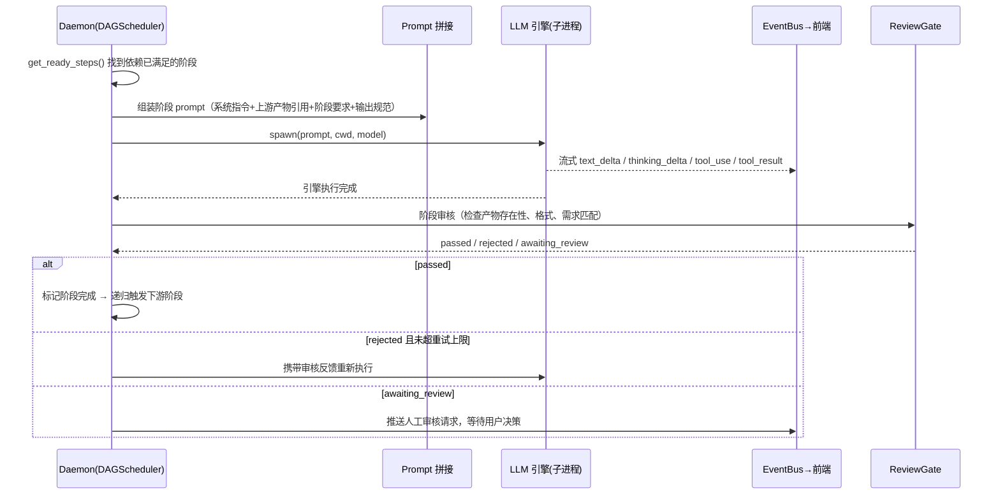

# WorkStep

> 本地优先 · 多 LLM 引擎 · 工作流编排工具

把「需求 → 设计 → 前端 → 后端 → 测试 → 上线」这类多步骤流程抽象成一条**可编排的管道（DAG）**：每个阶段是一个可配置的 LLM 任务节点，由本地 LLM 引擎（Claude Code / Codex CLI / Hermes ACP 等）自动执行；阶段之间通过**产物文件**衔接，全程流式可见、可自动审核、可人工干预。

---

## 项目概况

WorkStep 是面向独立开发者 / 小团队的本地工作流编排工具。它不是又一个 Chat UI，而是让用户把任意多步骤流程（研发、写作、数据分析、运营……）定义成管道，由 LLM 引擎把「输入」一路跑到「产物」。

| 特性 | 说明 |
|---|---|
| **多引擎统一抽象** | Claude / Codex / Hermes / Qoder / API 直调等引擎，统一为同一套内部事件，阶段可逐节点指定引擎 |
| **流程即代码** | 工作流定义在 `.workstep/steps.json`，任意步骤、提示词、I/O、依赖关系、条件路由均可拖拽编排 |
| **本地优先** | LLM 调用、会话历史、产物文件全部留在本地；每个项目独立 `.workstep/workstep.db` |
| **流式可干预** | 每一步思考 / 工具调用 / 产物实时推送；阶段完成后自动审核，失败自动重试或转人工 |
| **DAG 并行** | 支持并行分支（前端 + 后端同时执行）与汇合点（测试等待两者完成） |

### 技术栈

| 层 | 技术 |
|---|---|
| 后端 Daemon | Python 3.11+ · FastAPI · Peewee（SQLite）· asyncio.subprocess |
| 前端 Web | React · TypeScript · Vite · React Flow · Zustand |
| 实时通信 | WebSocket / SSE（全局事件流） |
| 数据 | 每项目一个 SQLite（`.workstep/workstep.db`） |

### 仓库结构

```
apps/daemon/   # Python + FastAPI 后台服务（API / 引擎层 / DAG 调度 / 审核门）
apps/web/      # React + TypeScript + Vite 前端（任务列表 / 详情 / 画布编辑器）
ui/            # 静态 HTML 原型（浏览器直接打开）
docs/          # 产品文档（PRD、引擎协议设计、LLM 引擎开发指南）
plans/         # 技术架构文档（按功能拆分）
```

## 快速开始

### 环境要求

- Python 3.11+，包管理器 [uv](https://docs.astral.sh/uv/)（`curl -LsSf https://astral.sh/uv/install.sh | sh`）
- Node.js 20+（推荐使用 [Volta](https://volta.sh/)，仓库已固定 `node@20` / `yarn@1`）
- 本地已安装至少一个 LLM 引擎 CLI（Claude Code / Codex CLI / Hermes 等，用于真实执行阶段）

### 一键启动（推荐）

```bash
git clone <repo-url>
cd workstep

./start.sh            # 默认 dev 模式：daemon + Vite dev server（HMR）
./start.sh 8765 prod  # prod 模式：构建前端，由 daemon 统一 serve
./stop.sh             # 停止所有服务
./restart.sh          # 重启
```

启动后访问：

| 服务 | 地址 |
|---|---|
| Web 前端（dev） | <http://localhost:5173> |
| Daemon API | <http://localhost:8765> |
| API 文档（Swagger） | <http://localhost:8765/docs> |

### 分开启动（开发调试）

```bash
# 终端 1 — 后端 Daemon
cd apps/daemon
uv sync --dev
uv run uvicorn main:app --reload --port 8765

# 终端 2 — 前端 Web（Vite dev server，代理 /api 与 /ws 到 8765）
cd apps/web
npm install
npm run dev
```

### 运行测试与构建

```bash
# 后端测试
cd apps/daemon
uv run pytest

# 前端 lint / 构建
cd apps/web
npm run lint
npm run build
```

### 静态原型（无需构建）

```bash
open ui/index.html        # 主面板
open ui/canvas-editor.html
open ui/card-detail.html
```

---

## 架构总览

```
┌──────────────────────────────────────────────────┐
│ 前端（Web / 静态原型）                             │
│  任务列表 · 任务详情 · 画布编辑器 · 设置             │
└───────────────┬──────────────────────────────────┘
                │ REST /api/* + WebSocket /ws
┌───────────────▼──────────────────────────────────┐
│ Daemon（FastAPI + Peewee）                        │
│  ┌─────────────┐  ┌──────────────┐                │
│  │ TaskRunner  │  │ DAGScheduler │  ← steps.json  │
│  │ 阶段执行     │  │ DAG 调度      │                │
│  └──────┬──────┘  └──────────────┘                │
│  ┌──────▼──────────────────────────────────────┐  │
│  │ 引擎抽象层 BaseLLMEngine（注册表按引擎解析）   │  │
│  │ 统一事件流：text/thinking/tool/usage/error   │  │
│  └──────┬──────────────────────────────────────┘  │
│  ┌──────▼───────┐  ┌────────────┐  ┌───────────┐  │
│  │ ReviewGate   │  │ EventBus   │  │ 产物目录    │  │
│  │ 阶段审核/重试 │  │ 实时推送    │  │ artifacts/ │  │
│  └──────────────┘  └────────────┘  └───────────┘  │
└───────────────┬──────────────────────────────────┘
                │ asyncio.subprocess spawn + stdin/stdout 管道
     ┌──────────┼────────────┬───────────┬───────────┐
     ▼          ▼            ▼           ▼           ▼
  claude      codex       hermes      qoder      api直调
 (CLI/ACP)  (CLI/ACP)     (ACP)       (ACP)     (HTTP/SSE)
```

---

## 工作流：流程即代码

### 默认研发流程

内置模板把研发流程编排为如下 DAG，阶段通过 `dependsOn` 声明依赖：



- `req → ui` 为线性链路：UI 设计依赖需求产物（PRD）
- `frontend` 与 `backend` 是**并行分支**：UI 设计完成后同时启动两个引擎子进程
- `test` 是**汇合点**：等待前端与后端都通过后才启动

除研发流程外，内置还有写作、数据分析、财务、HR、法务等模板（见 `apps/daemon/data/templates/`）；用户可在画布上自由增删、重排阶段，或从空白画布自定义任意管道。

### steps.json 定义

每个项目的管道定义在 `.workstep/steps.json`：

```json
{
  "steps": [
    {
      "key": "req",
      "label": "需求",
      "engine": "claude",
      "prompt": "根据业务需求产出 PRD 文档……",
      "outputs": [{"name": "PRD 文档", "type": "markdown"}],
      "dependsOn": []
    },
    {
      "key": "ui",
      "label": "UI 设计",
      "engine": "claude",
      "prompt": "根据 PRD 设计 UI……",
      "outputs": [{"name": "UI 设计稿", "type": "markdown"}],
      "dependsOn": ["req"]
    }
  ]
}
```

每个阶段的核心字段：

| 字段 | 说明 |
|---|---|
| `key` / `label` | 阶段标识 / 展示名 |
| `engine` | 执行引擎（claude / codex / hermes / qoder / api / pydantic_ai） |
| `prompt` | 阶段要求，随任务描述、上游产物引用一起拼入提示词 |
| `inputs` / `outputs` | 输入输出规范（名称 + 类型），用于约束产物格式 |
| `dependsOn` | 上游依赖列表，构建 DAG |
| `condition` | 可选条件路由（如 `test:passed`） |
| `review` | 可选审核配置（auto / maxRetries / engine / prompt） |

### DAG 调度

`DAGScheduler` 根据 `dependsOn` 构建有向无环图（含环检测与缺失依赖校验）。调度核心逻辑：**只有当某个阶段的所有上游都已通过时，它才进入 ready 集合**，ready 集合内的阶段通过 `asyncio.gather` 并行执行；每完成一批，递归检查是否有新的 ready 阶段，直到所有阶段完成。

---

## LLM 引擎如何完成每个阶段

### 引擎抽象

所有引擎实现同一个 `BaseLLMEngine` 接口（`apps/daemon/engines/base.py`），新增引擎 = 新增一个文件：

- `spawn(prompt, cwd, model, ...)` → 启动子进程，异步流式 yield 统一内部事件
- `stop()` → 终止子进程
- `inject_response(tool_use_id, content)` → 中途注入用户回答 / 权限响应
- `supports_resume` / `build_resume_params()` → 会话恢复（如 Codex `--resume`）

引擎注册表（`engines/registry.py`）按后端名称解析最佳可用实现，ACP 优先、直连 CLI 兜底：

| 后端 | 优先 | 兜底 | 会话恢复 | 交互 |
|---|---|---|---|---|
| claude | `claude_acp` | `claude`（JSONL 流） | ✅ | ✅ |
| codex | `codex_acp` | `codex`（`codex exec --json`） | 视模式 | ✅ |
| hermes | `hermes`（JSON-RPC） | — | ❌ | ✅ |
| qoder | `qoder_acp` | — | ❌ | ✅ |
| qcode / openclaw | 直连 CLI | — | 待定 | 待定 |
| api / pydantic_ai | HTTP 直调 | — | ❌ | ❌ |

引擎的 stdout（无论 JSONL、JSON-RPC 还是 SSE）都被解析器归一化为统一的**内部事件**：`status` / `text_delta` / `thinking_delta` / `tool_use` / `tool_result` / `usage` / `error`。前端只消费这套事件，不感知底层引擎差异。

### 阶段执行时序



---

## 阶段之间如何衔接

### 产物落盘

每个阶段执行前，Daemon 创建该阶段的产物目录；引擎（通常是 Codex / Claude 的工具调用 Write）把产物写入对应目录：

```
项目根/.workstep/artifacts/
└── <工作流>/                     # 流程（task.workflow_id，缺省 default）
    └── <任务>/                   # 任务 ID
        └── <阶段>/               # 阶段 key（req / ui / frontend / ...）
            └── <产物名>/         # 输出点（steps.json 中声明的 outputs 名称）
                └── xxx.md        # 实际产物文件
```

### Prompt 拼接：阶段间上下文传递

下游阶段启动时，Daemon 扫描**所有上游阶段的产物目录**，把文件路径列表注入 prompt 作为「上游产物引用」——这就是阶段间衔接的载体：

```
┌────────────────────────────────────────────────┐
│ ① 系统指令（WorkStep 阶段角色 + 工具契约）        │
├────────────────────────────────────────────────┤
│ ② 上游产物引用                                  │
│    "以下文件已就绪: .workstep/artifacts/req/…"    │
│    （从 dependsOn 阶段目录自动扫描生成）           │
├────────────────────────────────────────────────┤
│ ③ 阶段要求（steps.json 的 prompt 字段）           │
├────────────────────────────────────────────────┤
│ ④ 任务说明 / 用户补充输入                         │
├────────────────────────────────────────────────┤
│ ⑤ 输出规范（每个产物的类型约束 + 写入路径）        │
├────────────────────────────────────────────────┤
│ ⑥ 产物输出目录                                  │
└────────────────────────────────────────────────┘
```

典型链路：`req` 产出 PRD → `ui` 读取 PRD 产出设计稿 → `frontend` / `backend` 分别读取设计稿 / PRD 产出代码 → `test` 读取前后端代码产出测试报告 → `deploy` 读取测试报告完成上线。

### 阶段审核与自动重试

每个阶段完成后，可选的 `ReviewGate` 自动审核（`plans/08-stage-review-and-auto-retry.md`）：

- 审核 Agent 检查**产物文件是否存在、格式是否符合输出规范、内容是否满足阶段要求**，返回 JSON 结论（passed / rejected / awaiting_review）
- `passed` → 标记阶段完成，触发下游
- `rejected` 且未超过 `maxRetries` → 携带审核反馈重新执行该阶段
- `awaiting_review` → 暂停等待人工决定（人工通过 / 打回重试）

### 并行与汇合

分支阶段通过 `asyncio.gather` 并发启动多个引擎子进程；汇合阶段依赖多个上游，只有所有上游都 `passed` 才会进入 ready 集合，天然形成「等待所有分支完成」的汇合语义。

---

## 文档索引

| 文档 | 内容 |
|---|---|
| `docs/prd.md` | 产品需求文档 |
| `docs/run_llm.md` | LLM 引擎调用协议设计 |
| `docs/llm-engine-development-guide.md` | 接入新引擎的开发指南 |
| `plans/00-architecture-overview.md` | 技术架构总览 |
| `plans/02-engine-abstraction.md` | 引擎抽象层与统一事件 |
| `plans/03-data-model.md` | 数据模型与 Schema |
| `plans/04-pipeline.md` | 工作流编排、DAG 调度、产物衔接 |
| `plans/08-stage-review-and-auto-retry.md` | 阶段审核与自动重试 |
| `plans/07-current-state-and-development-plan.md` | 当前状态与开发计划 |
