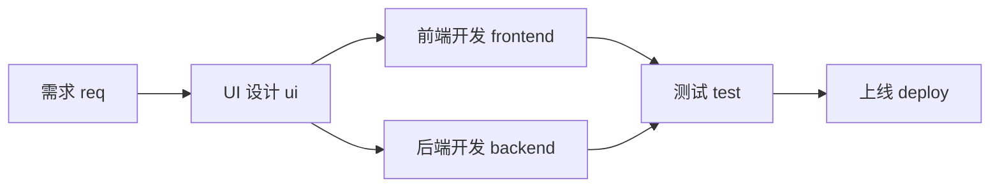
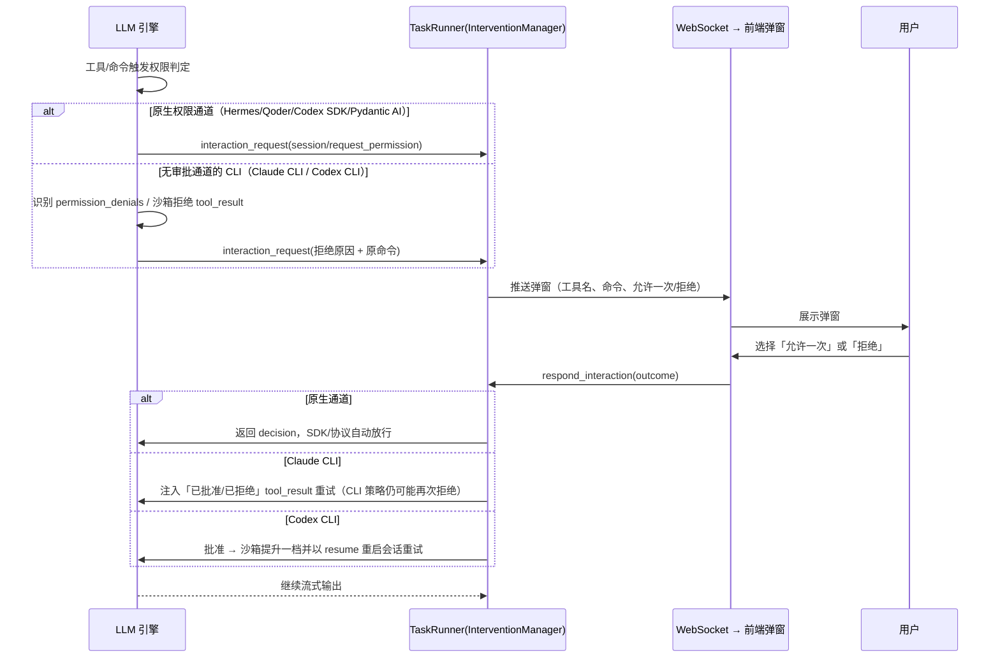
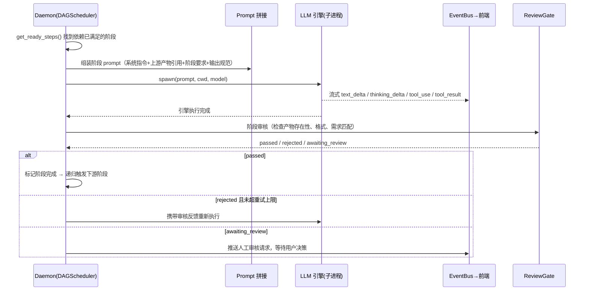
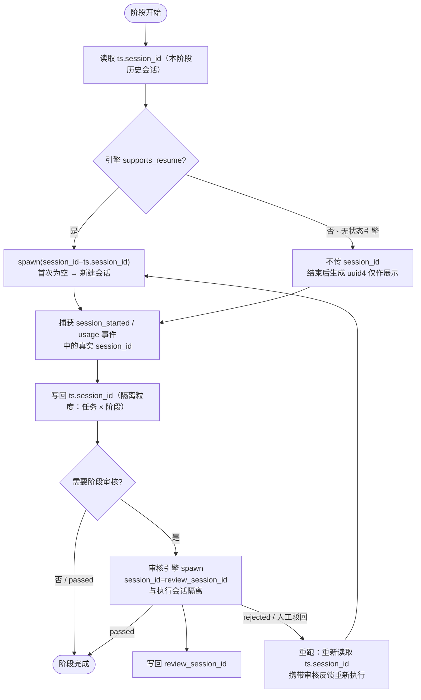

# WorkStep

[English](README.md) · [官网](https://xzregg.github.io/workstep/) · [文档](docs/README.md) · [讨论区](https://github.com/xzregg/workstep/discussions)

> 一个本地优先的工作流编排工具，把 Codex、Claude Code、ACP Agent 等多个 LLM 引擎串成可观察、可复用的研发流水线。

[](https://github.com/xzregg/workstep/actions/workflows/ci.yml)
[](https://github.com/xzregg/workstep/releases)
[](LICENSE)
[](apps/daemon/pyproject.toml)
[](apps/web/package.json)


> 本地优先 · 多 LLM 引擎 · 工作流编排工具

把「需求 → 设计 → 前端 → 后端 → 测试 → 上线」这类多步骤流程抽象成一条**可编排的管道（DAG）**：每个阶段是一个可配置的 LLM 任务节点，由本地 LLM 引擎（Claude Code / Codex CLI / Hermes ACP 等）自动执行；阶段之间通过**产物文件**衔接，全程流式可见、可自动审核、可人工干预。

---

## 核心能力

- 本地优先，每个项目使用独立 SQLite 数据库。
- 可视化工作流，支持并行阶段和可复用模板。
- 多种执行引擎统一到同一套会话与事件模型。
- 实时输出、工具审批、暂停恢复与会话续接。
- 可选的远程项目分享，不把本地后台变成托管服务。

## 项目概况

WorkStep 是面向独立开发者 / 小团队的本地工作流编排工具。它不是又一个 Chat UI，而是让用户把任意多步骤流程（研发、写作、数据分析、运营……）定义成管道，由 LLM 引擎把「输入」一路跑到「产物」。

| 特性 | 说明 |
|---|---|
| **多引擎统一抽象** | Claude / Codex / Hermes / Qoder / Pydantic AI 等引擎，统一为同一套内部事件，阶段可逐节点指定引擎；API 凭据通过「供应商」统一管理（支持从 cc-switch 导入） |
| **流程即代码** | 工作流定义在 `.workstep/steps.json`，任意步骤、提示词、I/O、依赖关系、条件路由均可拖拽编排 |
| **本地优先** | LLM 调用、会话历史、产物文件全部留在本地；每个项目独立 `.workstep/workstep.db` |
| **流式可干预** | 每一步思考 / 工具调用 / 产物实时推送；阶段完成后自动审核，失败自动重试或转人工 |
| **DAG 并行** | 支持并行分支（前端 + 后端同时执行）与汇合点（测试等待两者完成） |
| **定时任务助手** | 定时任务到点后可由任务创建 Agent 生成标题/内容并在候选流程中选择目标，失败自动重试 |

### 技术栈

| 层 | 技术 |
|---|---|
| 后端 Daemon | Python 3.11+ · FastAPI · Peewee（SQLite）· asyncio.subprocess |
| 前端 Web | React · TypeScript · Vite · React Flow · Zustand |
| 实时通信 | WebSocket / SSE（全局事件流） |
| 数据 | 每项目一个 SQLite（`.workstep/workstep.db`） |

### 仓库结构

```
apps/daemon/   # Python + FastAPI 后台服务（API / 引擎层 / DAG 调度 / 审核门）
apps/web/      # React + TypeScript + Vite 前端（任务列表 / 详情 / 画布编辑器）
apps/landing/  # 产品介绍页（独立 Vite 应用：中英双语 + 操作演示播放器）
ui/            # 静态 HTML 原型（浏览器直接打开）
docs/          # 产品文档（PRD、引擎协议设计、前端设计规范、LLM 引擎开发指南）
plans/         # 技术架构文档（按功能拆分）
```

## 快速开始

### 环境要求

- Python 3.11+，包管理器 [uv](https://docs.astral.sh/uv/)（`curl -LsSf https://astral.sh/uv/install.sh | sh`）
- Node.js 20+（推荐使用 [Volta](https://volta.sh/)，仓库已固定 `node@20` / `yarn@1`）
- 本地已安装至少一个 LLM 引擎 CLI（Claude Code / Codex CLI / Hermes 等，用于真实执行阶段）

### 一键启动（推荐）

```bash
git clone <repo-url>
cd workstep

./start.sh            # 默认 dev 模式：daemon + Vite dev server（HMR）
./start.sh 8765 prod  # prod 模式：构建前端，由 daemon 统一 serve
./stop.sh             # 停止所有服务
./restart.sh          # 重启
```

启动后访问：

| 服务 | 地址 |
|---|---|
| Web 前端（dev） | <http://localhost:5173> |
| Daemon API | <http://localhost:8765> |
| API 文档（Swagger） | <http://localhost:8765/docs> |

### 分开启动（开发调试）

```bash
# 终端 1 — 后端 Daemon
cd apps/daemon
uv sync --dev
uv run uvicorn main:app --reload --port 8765

# 可选：为当前实例指定独立的程序配置目录（默认 ~/.workstep/）
WORKSTEP_CONFIG_DIR=/path/to/workstep-device-b uv run uvicorn main:app --reload --port 8766

# 终端 2 — 前端 Web（Vite dev server，代理 /api 与 /ws 到 8765）
cd apps/web
npm install
npm run dev
```

### 运行测试与构建

```bash
# 后端测试
cd apps/daemon
uv run pytest

# 前端 lint / 构建
cd apps/web
npm run lint
npm run build
```

### 静态原型（无需构建）

```bash
open ui/index.html        # 主面板
open ui/canvas-editor.html
open ui/card-detail.html
```

### 产品介绍页

```bash
cd apps/landing
yarn install
yarn dev        # http://localhost:5174
```

介绍页是独立应用，与产品 UI 解耦：演示场景用网页时间轴动画重演真实界面（非录屏），
下载平台链接集中在 `apps/landing/src/config/downloads.ts`，正式安装包地址就绪后填入即可。

生产模式下 Daemon 会托管官网与 Web 应用：`./start.sh prod` 会同时构建
`apps/landing`（→ `http://<host>:8765/landing`，构建时使用
`LANDING_BASE=/landing/` 使静态资源位于 `/landing` 子路径）与 `apps/web`
（→ `http://<host>:8765/`，保持 home 不变）。

---

## 架构总览

```
┌──────────────────────────────────────────────────┐
│ 前端（Web / 静态原型）                             │
│  任务列表 · 任务详情 · 画布编辑器 · 设置             │
└───────────────┬──────────────────────────────────┘
                │ REST /api/* + WebSocket /ws
┌───────────────▼──────────────────────────────────┐
│ Daemon（FastAPI + Peewee）                        │
│  ┌─────────────┐  ┌──────────────┐                │
│  │ TaskRunner  │  │ DAGScheduler │  ← steps.json  │
│  │ 阶段执行     │  │ DAG 调度      │                │
│  └──────┬──────┘  └──────────────┘                │
│  ┌──────▼──────────────────────────────────────┐  │
│  │ 引擎抽象层 BaseLLMEngine（注册表按引擎解析）   │  │
│  │ 统一事件流：text/thinking/tool/usage/error   │  │
│  └──────┬──────────────────────────────────────┘  │
│  ┌──────▼───────┐  ┌────────────┐  ┌───────────┐  │
│  │ ReviewGate   │  │ EventBus   │  │ 产物目录    │  │
│  │ 阶段审核/重试 │  │ 实时推送    │  │ artifacts/ │  │
│  └──────────────┘  └────────────┘  └───────────┘  │
└───────────────┬──────────────────────────────────┘
                │ asyncio.subprocess spawn + stdin/stdout 管道
     ┌──────────┼────────────┬───────────┬───────────┐
     ▼          ▼            ▼           ▼           ▼
  claude      codex       hermes   claude_agent_sdk  codex_sdk    api直调
  (CLI)      (CLI)       (ACP)       (SDK)          (SDK)      (HTTP/SSE)
```

---

## 工作流：流程即代码

### 默认研发流程

内置模板把研发流程编排为如下 DAG，阶段通过 `dependsOn` 声明依赖：



- `req → ui` 为线性链路：UI 设计依赖需求产物（PRD）
- `frontend` 与 `backend` 是**并行分支**：UI 设计完成后同时启动两个引擎子进程
- `test` 是**汇合点**：等待前端与后端都通过后才启动

除研发流程外，内置还有写作、数据分析、财务、HR、法务等模板（见 `apps/daemon/data/templates/`）；用户可在画布上自由增删、重排阶段，或从空白画布自定义任意管道。

### steps.json 定义

每个项目的管道定义在 `.workstep/steps.json`：

```json
{
  "steps": [
    {
      "key": "req",
      "label": "需求",
      "engine": "claude",
      "prompt": "根据业务需求产出 PRD 文档……",
      "outputs": [{"name": "PRD 文档", "type": "markdown"}],
      "dependsOn": []
    },
    {
      "key": "ui",
      "label": "UI 设计",
      "engine": "claude",
      "prompt": "根据 PRD 设计 UI……",
      "outputs": [{"name": "UI 设计稿", "type": "markdown"}],
      "dependsOn": ["req"]
    }
  ]
}
```

每个阶段的核心字段：

| 字段 | 说明 |
|---|---|
| `key` / `label` | 阶段标识 / 展示名 |
| `engine` | 执行引擎（claude / codex / hermes / claude_agent_sdk / codex_sdk / api / pydantic_ai） |
| `prompt` | 阶段要求，随任务描述、上游产物引用一起拼入提示词 |
| `inputs` / `outputs` | 输入输出规范（名称 + 类型），用于约束产物格式 |
| `dependsOn` | 上游依赖列表，构建 DAG |
| `condition` | 可选条件路由（如 `test:passed`） |
| `review` | 可选审核配置（auto / maxRetries / engine / prompt） |

### DAG 调度

`DAGScheduler` 根据 `dependsOn` 构建有向无环图（含环检测与缺失依赖校验）。调度核心逻辑：**只有当某个阶段的所有上游都已通过时，它才进入 ready 集合**，ready 集合内的阶段通过 `asyncio.gather` 并行执行；每完成一批，递归检查是否有新的 ready 阶段，直到所有阶段完成。

---

## LLM 引擎如何完成每个阶段

### 引擎抽象

所有引擎实现同一个 `BaseLLMEngine` 接口（`apps/daemon/engines/core/base.py`），新增引擎 = 在 `apps/daemon/engines/` 下新增一个文件并声明 `ENGINE_ID`，自动注册：

- `spawn(prompt, cwd, model, ...)` → 启动子进程，异步流式 yield 统一内部事件
- `stop()` → 终止子进程
- `inject_response(tool_use_id, content)` → 中途注入用户回答 / 权限响应
- `supports_resume` / `build_resume_params()` → 会话恢复（如 Codex `--resume`）

引擎注册表（`engines/core/registry.py`）自动扫描 `engines/` 根目录按 `ENGINE_ID` 解析实现：

| 后端 | 实现 | 会话恢复 | 交互 |
|---|---|---|---|
| claude | `claude`（JSONL 流） | ✅ | ✅ |
| codex | `codex`（`codex exec --json`） | ✅ | ✅ |
| hermes | `hermes`（JSON-RPC，复用 `AcpEngineBase`） | ✅ | ✅ |
| openclaw | 直连 CLI | 待定 | 待定 |
| api / pydantic_ai | HTTP 直调 / 进程内 Agent | ❌ | ❌ |
| claude_agent_sdk | 官方 Agent SDK 内嵌驱动 Claude Code | ✅ | ✅ |
| codex_sdk | 官方 Codex SDK 内嵌驱动 Codex | ✅ | ✅ |
| qoder_sdk | 官方 Qoder Agent SDK 内嵌驱动 qodercli | ✅ | ✅ |
| deepseek_harness | DeepSeek 官方 Harness SDK，默认 `standard` 多插件编码 Agent | ✅ | ❌（SDK 暂无审批通道） |

引擎的 stdout（无论 JSONL、JSON-RPC 还是 SSE）都被解析器归一化为统一的**内部事件**（`apps/daemon/engines/core/events.py`）：

- 执行流：`status` / `text_delta` / `thinking_delta` / `tool_use` / `tool_input_delta`（实时专用，不持久化）/ `tool_result` / `usage` / `compacted`（上下文已自动压缩）/ `error`
- 会话与交互：`session_started` / `live_message` / `interaction_request`（权限申请、AskUserQuestion 表单弹窗）/ `interaction_response` / `plan` / `subagent`（子代理生命周期）/ `engine_state`

| 引擎 | plan 事件 | subagent 事件 |
|---|---|---|
| claude (`claude_code`) | ✅（`TodoWrite`/`Task*` 工具 + `turn/plan`） | ✅（`task_started`/`task_progress`/`task_updated`/`task_notification` → `subagent`） |
| claude_agent_sdk | ✅（同上，SDK 驱动） | ✅（同上） |
| qoder_sdk | ✅（`TaskCreate`/`TaskUpdate`/`TaskList` 工具） | ✅（同上） |
| codex / codex_sdk | ✅（`turn.plan.updated` / `TodoWrite`） | ✅（`collabAgentToolCall` `spawnAgent` 等 → plan 条目；无生命周期帧） |
| hermes (ACP) | ✅（ACP `session/update` plan） | 协议无独立 subagent 事件；委托工具调用（input 含 `prompt`）自动并入 plan 条目 |
| openclaw | ❌（一次性信封） | ❌ |
| pydantic_ai | ❌（内置单 Agent） | ❌ |

前端只消费这套事件，不感知底层引擎差异。

### 内置 Pydantic 引擎（`pydantic_ai`）

`pydantic_ai` 是进程内引擎：无需子进程，直接用 Pydantic AI 加载已配置的 Provider（Anthropic / OpenAI 兼容），通过 `apps/daemon/engines/pydantic_ai/` 包提供沙箱工具：

- `engines.pydantic_ai.filesystem.FileSystem` — 受允许根目录限制的沙箱文件系统：`list_files` / `read_file` / `search_files` / `write_file` / `edit_file`（支持修改代码，路径逃逸会拒绝）
- `engines.pydantic_ai.memory.Memory` — 项目记忆，持久化为 `.workstep/MEMORY.md`（`## <key>` 小节，字符串存原文、结构化值存 JSON 代码块）。阶段执行时由流程引擎读取该文件，把内容注入阶段提示词的「项目记忆」区块（所有引擎一致，agent 只读参考，不再引导 agent 自行读写）；前端「编辑记忆」走 `/api/fs/memory`
- `engines.pydantic_ai.skills.Skills` — 技能注册表，只扫描当前项目下的 `.claude/skills`、`.codex/skills`、`.workstep/skills`（不扫描 home 目录），读取 `SKILL.md`（frontmatter name/description + 正文），工具 `list_skills` / `load_skill`

引擎指令会自动附加项目根目录的 `agents.md` / `AGENTS.md`，让代理遵守仓库约定。引擎实现在 `apps/daemon/engines/pydantic_ai/engine.py`。设置页「执行引擎 → Pydantic AI」可查看该项目实际加载的技能与配置的 MCP 服务器（`GET /api/engine/pydantic_ai/inspect`）。

### 执行中阶段消息（实时干预）

运行中的阶段支持接收普通用户消息并实时注入引擎（`POST /api/task/{id}/step/{key}/message`）：

- 引擎接口：`BaseLLMEngine.send_live_stage_message(content)` + `supports_live_stage_message` 能力声明；Claude Code 直连 CLI 通过 `--input-format stream-json` 实时输入模式实现，消息以 JSONL `user` 消息写入 stdin，turn 结束后 `close_stream` + 超时看门狗兜底
- 运行器：`TaskRunner` 为每个运行中阶段维护消息队列，阶段消息持久化为 `channel=execution` 用户消息并实时注入
- 聊天目标选择：任务详情聊天输入可切换「协调 Agent」（`channel=coordinator`）或「阶段 Agent」（`channel=execution`）；协调对话不进入阶段执行上下文，阶段注入消息也不进入协调上下文

### 权限申请与人工交互（统一 `interaction_request`）

所有引擎的「需要用户拍板」的场景（工具权限、AskUserQuestion 提问、沙箱拒绝）统一收敛为 ACP 形状的 `interaction_request` 事件：前端弹窗展示「允许一次 / 拒绝」，用户选择后经 WebSocket `respond`（或 `POST /api/intervention/respond`）回填，引擎按各自通道继续执行。



各引擎权限通道现状（`apps/daemon/engines/`）：

| 引擎 | 权限通道 | 弹窗（interaction_request） | 说明 |
|---|---|---|---|
| hermes（ACP） | `session/request_permission` + `tool_approve` | ✅ 原生 | 协议级审批，可停靠待批 |
| qoder_sdk | `can_use_tool` + `on_elicitation` | ✅ 原生 | 回调阻塞至用户决定 |
| pydantic_ai | 进程内 ask_user + 文件写权限 | ✅ 原生 | 沙箱文件系统按允许根目录约束 |
| codex_sdk | `approval_handler` 回调 | ✅ 原生 | SDK 默认自动接受，现改为弹窗后返回 decision |
| claude_agent_sdk | `can_use_tool` 回调 | ⚠️ 逻辑就绪 | 上游 SDK bug：回调 0 次调用并抛 `AbortError: Stream closed`，等待 SDK 修复 |
| claude（CLI） | 无（`-p` 模式自动拒绝） | ⚠️ 拒绝兜底 | 识别「requires approval」→ 弹窗 → 注入决定；CLI 策略无法中途放行 |
| codex（CLI） | 无（exec 模式无审批协议） | ⚠️ 拒绝兜底 | 识别沙箱拒绝 → 弹窗 → 批准后沙箱提档 + resume 重试 |

统一入口：`engines/core/base.py` 的 `request_interaction` / `respond_interaction`，事件构建见 `engines/core/interactions.py`（`permission_request` / `elicitation_request` / `claude_ask_user_request`）。

### 阶段执行时序



### 阶段会话隔离与复用

每个阶段运行在独立的引擎会话里：会话标识按「任务 × 阶段」隔离，落在 `TaskStep` 上（`session_id` 执行会话、`review_session_id` 审核会话），并行阶段互不串扰；同一阶段重跑时通过 resume 复用原会话，延续完整上下文。



复用触发场景：自动审核失败重试、人工驳回、下游 rework 触发上游重跑、手动重跑同一阶段。各引擎的 resume 实现：Codex CLI `codex exec resume <session_id>`、Codex SDK `thread_resume`、Claude Agent SDK `resume=`、Hermes/ACP `session/resume`；无状态引擎（如 `pydantic_ai`）没有原生会话，每次执行从零重建上下文。

---

## 阶段之间如何衔接

### 产物落盘

每个阶段执行前，Daemon 创建该阶段的产物目录；引擎（通常是 Codex / Claude 的工具调用 Write）把产物写入对应目录：

```
项目根/.workstep/artifacts/
└── <工作流>/                     # 流程（task.workflow_id，缺省 default）
    └── <任务>/                   # 任务 ID
        └── <阶段>/               # 阶段 key（req / ui / frontend / ...）
            └── <产物名>/         # 输出点（steps.json 中声明的 outputs 名称）
                └── xxx.md        # 实际产物文件
```

### Prompt 拼接：阶段间上下文传递

下游阶段启动时，Daemon 扫描**所有上游阶段的产物目录**，把文件路径列表注入 prompt 作为「上游产物引用」——这就是阶段间衔接的载体：

```
┌────────────────────────────────────────────────┐
│ ① 系统指令（WorkStep 阶段角色 + 工具契约）        │
├────────────────────────────────────────────────┤
│ ② 上游产物引用                                  │
│    "以下文件已就绪: .workstep/artifacts/req/…"    │
│    （从 dependsOn 阶段目录自动扫描生成）           │
├────────────────────────────────────────────────┤
│ ③ 阶段要求（steps.json 的 prompt 字段）           │
├────────────────────────────────────────────────┤
│ ④ 任务说明 / 用户补充输入                         │
├────────────────────────────────────────────────┤
│ ⑤ 输出规范（每个产物的类型约束 + 写入路径）        │
├────────────────────────────────────────────────┤
│ ⑥ 产物输出目录                                  │
└────────────────────────────────────────────────┘
```

典型链路：`req` 产出 PRD → `ui` 读取 PRD 产出设计稿 → `frontend` / `backend` 分别读取设计稿 / PRD 产出代码 → `test` 读取前后端代码产出测试报告 → `deploy` 读取测试报告完成上线。

### 阶段审核与自动重试

每个阶段完成后，可选的 `ReviewGate` 自动审核（`plans/08-stage-review-and-auto-retry.md`）：

- 审核 Agent 检查**产物文件是否存在、格式是否符合输出规范、内容是否满足阶段要求**，返回 JSON 结论（passed / rejected / awaiting_review）
- `passed` → 标记阶段完成，触发下游
- `rejected` 且未超过 `maxRetries` → 携带审核反馈重新执行该阶段
- `awaiting_review` → 暂停等待人工决定（人工通过 / 打回重试）

### 并行与汇合

分支阶段通过 `asyncio.gather` 并发启动多个引擎子进程；汇合阶段依赖多个上游，只有所有上游都 `passed` 才会进入 ready 集合，天然形成「等待所有分支完成」的汇合语义。

---

然后打开 `http://127.0.0.1:8765`。开发命令和仓库规范见[开发指南](docs/development.md)。

## 桌面端下载

创建 `v*` 标签后，GitHub Release 会自动生成 macOS Apple Silicon、macOS Intel、Windows x64 和 Linux x64 四种桌面包。早期版本暂未签名，系统首次打开时可能要求手动确认。请前往 [GitHub Releases](https://github.com/xzregg/workstep/releases) 下载。

## 文档入口

- [架构与数据流](docs/architecture.md)
- [开发指南](docs/development.md)
- [GitHub 仓库设置](docs/github-settings.md)
- [安全策略](SECURITY.md)
- [支持与提问](SUPPORT.md)

## 参与贡献

提交 PR 前请阅读 [CONTRIBUTING.md](CONTRIBUTING.md)。可复现缺陷和明确需求进入 Issues；使用问题、想法和设计讨论进入 [Discussions](https://github.com/xzregg/workstep/discussions)。安全漏洞请按 [SECURITY.md](SECURITY.md) 私下报告。

## Apache-2.0 有什么不一样？

它允许商业使用、修改和分发，并明确提供贡献者专利授权；再分发时需要保留许可证、版权和 NOTICE 信息，并说明你修改过的文件。它不要求衍生项目必须开源。可选的第三方引擎仍遵循各自条款，详见 [THIRD_PARTY_NOTICES.md](THIRD_PARTY_NOTICES.md)。
