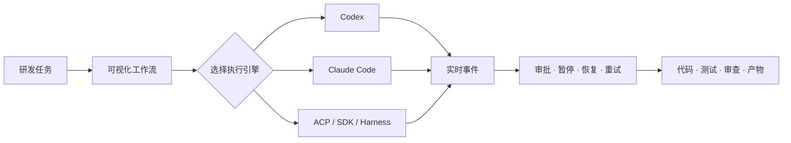

<div align="center">


# WorkStep

### 把多个 AI 编程引擎，编排成可观察、可控制的研发工作流

在一个可视化工作台中连接 Codex、Claude Code、ACP Agent、SDK 与本地 Harness，组织规划、开发、测试、审查和交付。

[官网](https://xzregg.github.io/workstep/) · [下载](https://github.com/xzregg/workstep/releases/latest) · [文档](docs/README.md) · [English](README.md)

[](https://github.com/xzregg/workstep/actions/workflows/ci.yml)
[](https://github.com/xzregg/workstep/releases/latest)
[](LICENSE)


</div>

## 30 秒了解 WorkStep



**WorkStep 不是另一个聊天窗口。** 它把一次性的 Agent 对话变成可复用的工程流程，让执行进度、工具调用、人工审批、上下文和最终产物始终可见。

## 核心能力

| | 能力 | 可以获得什么 |
|---|---|---|
| 🎛️ | **可视化编排** | 在工作流画布中组织串行、并行、审核和返工阶段，并复用流程模板。 |
| 🤖 | **多种 Agent 引擎** | 统一使用 CLI、SDK、ACP 和 Harness 引擎，不让流程绑定单一厂商。 |
| 👁️ | **全过程可观察** | 实时查看流式响应、工具调用、执行状态、结构化事件和步骤历史。 |
| 🛡️ | **人在回路中** | 审批敏感工具，暂停或终止任务，恢复会话，并重试失败阶段。 |
| 💾 | **本地优先存储** | 每个项目独立保存 SQLite 数据库、事件日志、模板和产物。 |
| 🔁 | **上下文可恢复** | 在中断或重启后继续任务，并恢复受支持引擎的原生会话。 |
| 📦 | **Web 与桌面端** | 可从源码运行，也提供 macOS Apple Silicon、Windows x64 和 Linux x64 早期安装包。 |
| 🔗 | **受控远程协作** | 按项目和设备授权远程访问，而不是默认把所有项目上传到中心化服务。 |

## 多种引擎，一套工作流

WorkStep 当前集成的引擎包括：

`Codex CLI` · `Codex SDK` · `Claude Code` · `Claude Agent SDK` · `OpenCode` · `OpenClaw` · `Hermes ACP` · `Cursor SDK` · `Qoder SDK` · `DeepSeek Harness` · `Pydantic AI`

不同引擎共用统一的发现、会话、审批、能力声明和事件边界。没有原生入口的能力会明确声明并安全降级，不伪造执行状态。

## 查看实际效果

[WorkStep 官网](https://xzregg.github.io/workstep/)提供交互式产品演示，可以直接了解项目工作台、流程画布、并行执行、审核节点和引擎切换。

## 快速开始

### 下载桌面版

最新版本提供：

-  **macOS Apple Silicon** — DMG 与 ZIP
- 🪟 **Windows x64** — NSIS 安装程序
- 🐧 **Linux x64** — AppImage

安装包、自动更新元数据、SHA-256 校验文件和依赖 SBOM 均可从 [GitHub Releases](https://github.com/xzregg/workstep/releases/latest) 下载。

> [!IMPORTANT]
> 桌面端目前是未签名的早期构建，Windows SmartScreen 或 macOS Gatekeeper 可能在首次运行时显示安全提醒。

### 从源码启动

环境要求：Python 3.11+、[uv](https://docs.astral.sh/uv/)、Node.js 20 或 22，以及通过 Corepack 或现有安装提供的 Yarn。

```bash
git clone https://github.com/xzregg/workstep.git
cd workstep
./start.sh
```

启动后访问 `http://127.0.0.1:5173`。本地后台 API 默认监听 `8765` 端口；各应用的开发和测试命令见[开发指南](docs/development.md)。

## 本地优先是怎样实现的

1. 每个项目的 `.workstep/` 目录独立保存数据库、事件日志、模板和产物。
2. 引擎通过本地后台执行，WorkStep 不会静默把项目复制到托管工作区。
3. 可选的远程访问需要明确授权，按项目和设备隔离，并可由项目所有者撤销。

“本地优先”描述的是 WorkStep 对项目数据的存储与编排方式；外部模型服务及可选引擎仍遵循其各自的网络和数据策略。

## 文档

- [产品概览](docs/overview.md)
- [架构与数据流](docs/architecture.md)
- [工作流执行](docs/workflow-engine-execution.md)
- [LLM 引擎开发](docs/llm-engine-development-guide.md)
- [桌面沙箱模式](docs/desktop-sandbox.md)
- [开发指南](docs/development.md)
- [安全策略](SECURITY.md)

## 社区与贡献

提交拉取请求前请阅读 [CONTRIBUTING.md](CONTRIBUTING.md)。可复现的缺陷和可执行的功能请求请提交到 [Issues](https://github.com/xzregg/workstep/issues)；问题讨论、想法与设计探索请使用 [Discussions](https://github.com/xzregg/workstep/discussions)。安全问题请按 [SECURITY.md](SECURITY.md) 私下报告。

## 许可证

WorkStep 使用 [Apache License 2.0](LICENSE)。可选的第三方引擎与服务遵循其各自条款，详见 [THIRD_PARTY_NOTICES.md](THIRD_PARTY_NOTICES.md)。
