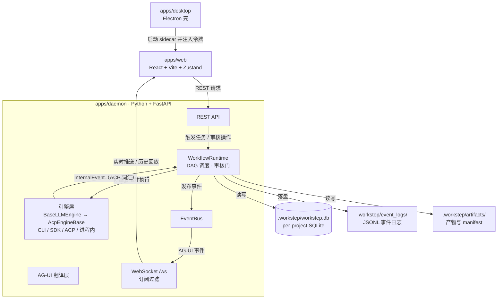

# WorkStep 架构概览

> 面向新加入项目的开发者，目标是在 30 分钟内建立系统全貌：模块职责、数据流向与关键边界。深入细节请继续阅读 `docs/architecture.md` 与 `docs/workflow-engine-execution.md`；接口字段冲突时以代码与测试为准。

## 1. 整体分层架构

WorkStep 是本地优先的工作流编排工具：项目与执行数据全部保存在项目自身目录 `<project>/.workstep/` 下，不依赖云端账户。系统由三个核心应用组成：

- **daemon**（`apps/daemon`，Python + FastAPI）：系统核心，承担 REST API、WebSocket、项目数据库、工作流编排、引擎运行时与助手运行时。同步的 Peewee 数据库操作统一提交到每个项目的 `ProjectDatabaseExecutor`，不直接跑在事件循环线程上。
- **web**（`apps/web`，React + TypeScript + Vite + Zustand）：任务列表、流程画布、聊天、设置与实时状态 UI；生产环境由 daemon 托管静态资源。
- **desktop**（`apps/desktop`，Electron）：打包内置 Python 运行时与 daemon 源码；sidecar 只监听 127.0.0.1，随机令牌由主进程注入，渲染进程不可读取。

daemon 默认监听 8765 端口提供 API 与 WebSocket；开发模式下 web 通过 Vite 开发服务器（5173）连接本地 daemon。仓库中另有 landing 等辅助子应用，不属于核心编排链路。

事件流有一条清晰的协议边界：**引擎 → 编排层是 ACP 词汇**（`InternalEvent`，定义于 `engines/core/events.py`），**编排层 → 前端是 AG-UI**（`engines/core/agui.py` 是唯一翻译层，实时推送与历史回放共用同一路径）。前端 store 只消费 AG-UI，不直接解释引擎私有事件。



## 2. 多引擎支持

引擎代码位于 `apps/daemon/engines/`，核心是两层基类加自动注册表：

- **`BaseLLMEngine`**（`engines/core/base.py`）：协议无关层，承载配置表单、模型枚举、二进制解析、安装与版本探测，以及 `EngineCapabilities` 能力位声明。
- **`AcpEngineBase`**（`engines/core/acp_base.py`）：ACP 协议执行层，统一提供 spawn 入口、会话生命周期（create / load / resume / fork / close / cancel）、工具审批与交互回传，并把 ACP 会话更新映射为内部事件。

引擎按传输方式分流：ACP 原生引擎（Hermes、OpenCode）直接复用基类客户端；CLI（Claude Code、Codex CLI）、SDK（Claude Agent SDK、Codex SDK 等）与进程内引擎（Pydantic AI）覆盖 `spawn`，但产出的仍是 ACP 词汇事件。上层调用方只依赖 `AcpEngineBase` 接口。

注册表（`engines/core/registry.py`）在模块导入时扫描 `engines/` 一级模块，收集声明了 `ENGINE_ID` 的引擎类——**新增引擎只需放一个新模块，无需改动注册表**。已安装引擎进入公开注册表，未安装的保留供设置页展示安装入口；`get_available_engines()` 返回含版本、运行模式与能力位的清单，版本探测并发执行并带缓存，安装完成后可调用 `refresh_registry()` 重新扫描。能力声明遵循"声明即实际"：不支持的能力保持 False 安全默认，未知来源的事件不会被合成。

## 3. 数据模型

每个项目拥有独立的 SQLite 数据库（`.workstep/workstep.db`，Peewee ORM），完整集合见 `apps/daemon/models/__init__.py::ALL_MODELS`。核心表按职责分组：

- **任务与流程**：`tasks`、`task_steps`（每个步骤的当前状态投影）；`workflows`（流程定义）、`workflow_runs`、`step_runs`、`review_runs`（执行历史）。
- **消息**：`messages` 保存可见正文与摘要；完整事件日志落盘到 `.workstep/event_logs/` 的 JSONL 文件，表内只留 `event_log_path` 等摘要信息。
- **产物**：步骤产物按工作流、任务、步骤、轮次的目录结构存放在 `.workstep/artifacts/`，每轮目录内含 `manifest.json` 与产物文件；没有独立的产物数据表。
- **助手与会话**：`chat_sessions` / `chat_messages`（会话聊天）；`coordinator_sessions` / `coordinator_turns` / `action_proposals`（协调助手）。
- **其他**：`schedules`（定时任务）、`task_shares`（分享）、`project_settings`；`channels` 与 `channel_chat_mappings` 是旧个人微信渠道的历史兼容表。

关系上：`Task` 1→N `WorkflowRun`（每次运行或局部重跑），`WorkflowRun` 1→N `StepRun`（步骤 attempt）与 `ReviewRun`（审核 attempt）。`TaskStep` 是可变的当前状态投影，`StepRun` / `ReviewRun` 是追加式不可变历史——局部重跑必须新建子 `WorkflowRun`，不改写父运行的历史。工作流状态由 Task、WorkflowRun、TaskStep、StepRun、ReviewRun 五层共同组成，任何非终态都有自动或人工的收敛路径。

## 4. 工作流编排

流程定义持久化在 `workflows` 表（前端画布保存节点与连线），`WorkflowDefinition` 负责校验并编译为执行 DAG。一次步骤执行的主链路：

`WorkflowRuntime` → `TaskRunner`（services/task_runner.py）构建 `DAGScheduler`（services/pipeline.py）选取 ready 步骤 → `resolve_input_snapshot()` 按连接端口解析输入快照、`route_artifact_round()` 路由产物（均在 services/artifact_routing.py）→ `assemble_prompt()` 组装提示词与输出契约（services/prompt.py）→ 引擎执行产出内部事件 → `ReviewGate`（services/review_gate.py）审核收尾。

- **DAG 调度**：`DAGScheduler` 负责环检测、依赖校验与 ready 步骤计算，运行时据此并行启动步骤；汇合节点要求所有依赖通过、且每条输入连接都有非空产物激活后才执行，未激活分支一次性标记 skipped。任务与助手对话的并发由 `ConcurrencyGate`（services/concurrency.py）分通道管理。
- **审核**：支持关闭 / 自动 / 人工三种模式。自动审核明确拒绝时可按 `review.maxRetries` 重试；审核 Agent 报错或结果无效时转人工，不把错误当作返工意见。人工审核停在 `awaiting_review`，通过、驳回、强制通过均作用于明确的 attempt 记录。需要强调：审核与产物路由是两个独立的门——`skip` 只跳过审核、不跳过路由，只有声明产物非空的输出端口才会激活相连的下游。
- **打回与重试**：虚线是产物驱动的返回连接——源端口产出非空文件后，目标步骤及其正向下游回退重跑；每个步骤用 `maxReturnRounds` 独立限制返回次数（默认 3，允许 1–20），超限则暂停流程。该上限与审核重试相互独立，计数持久化在 `WorkflowRun.routing_state_json`。
- **恢复**：daemon 启动时扫描仍为 running 的运行，按租约判断是否接管；运行期心跳每 15 秒巡检在线孤儿并收敛；用户停止或从指定步骤重跑始终是可用的人工出口。

## 5. 实时通道

主事件通道是 WebSocket `/ws`。事件发布经 `EventBus`（`streaming/bus.py`）分发给各连接，**订阅过滤在入队前执行**，避免慢客户端收到无关事件：

```json
{
  "type": "subscribe",
  "task_ids": [],
  "status_only_task_ids": [],
  "session_ids": [],
  "channels": []
}
```

`task_ids` 订阅完整事件流，`status_only_task_ids` 只接收状态变更，`channels` 按消息通道（execution / coordinator 等）过滤；未发送订阅消息的旧客户端保持全量广播兼容。

推送侧，EventBus 输出的内部事件经 AG-UI 翻译层转为 `RUN_STARTED`、`TEXT_MESSAGE_*`、`TOOL_CALL_*`、`CUSTOM` 等标准事件；WorkStep 特有事件走 `CUSTOM` 通道（`workstep.*` 前缀），并携带 task / step / message / channel 扩展字段供前端分流。历史回放与实时推送共用同一条翻译路径，保证两端语义一致。