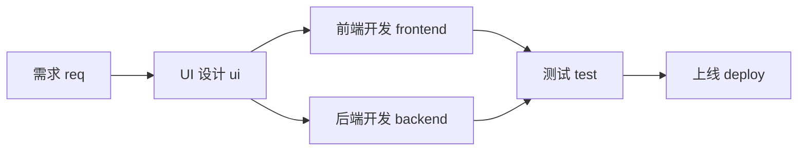
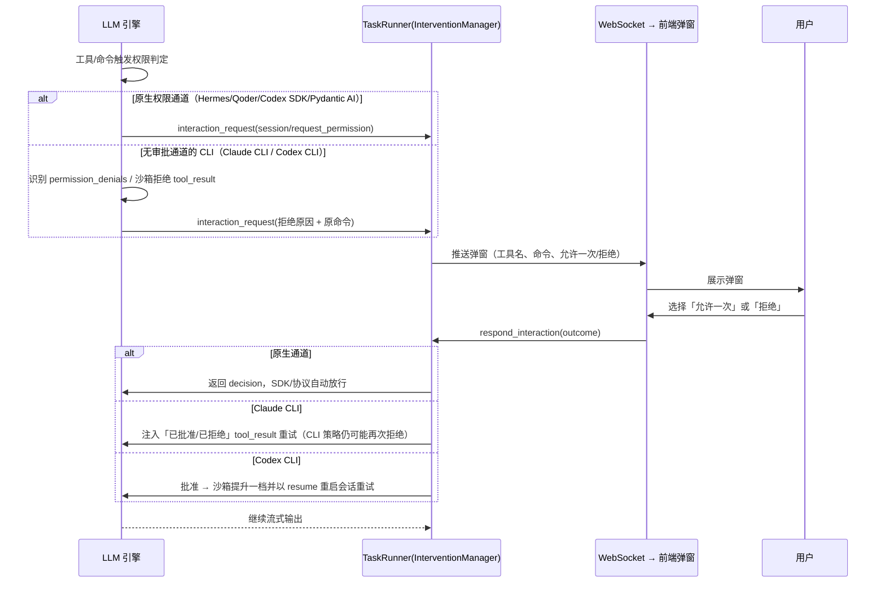
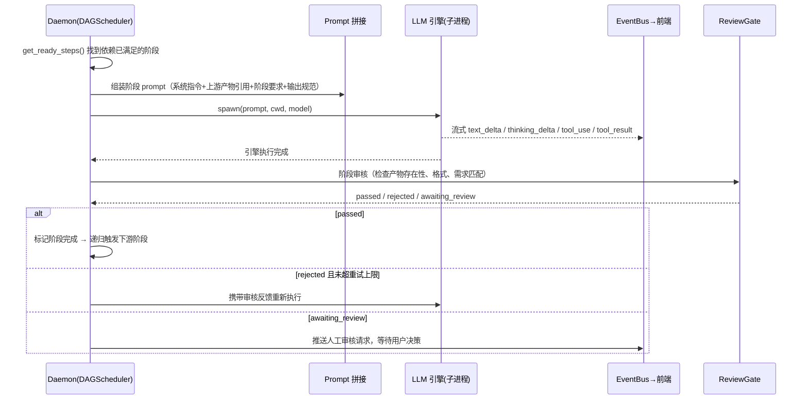
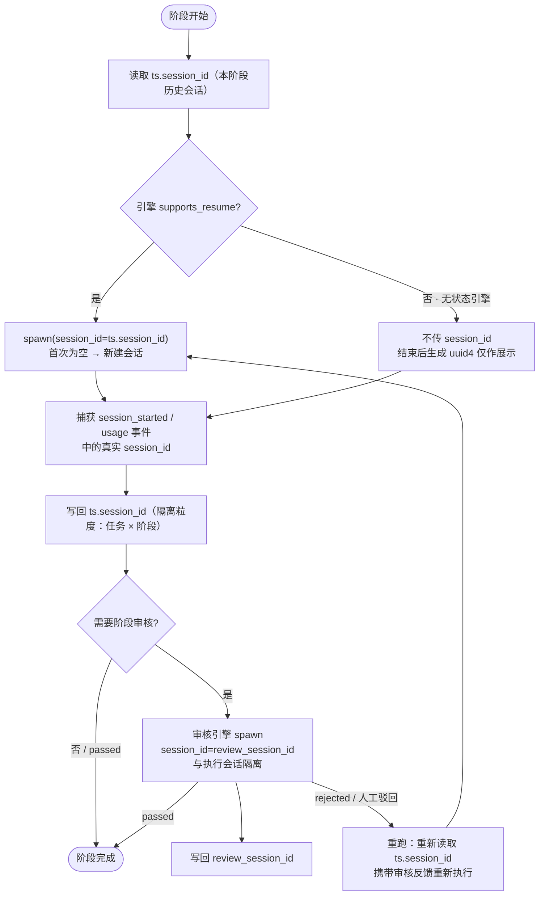

# Architecture

WorkStep is a local-first system with three distributable surfaces: `apps/daemon` is the Python/FastAPI orchestration and persistence service; `apps/web` is the React/TypeScript application; `apps/desktop` is an Electron shell that starts a Nuitka standalone daemon sidecar. The sidecar binds only to `127.0.0.1`, uses port `0` by default, and reports the operating-system-selected port through the `PORT:<port>` stdout protocol. The marketing site is in `apps/landing`, while early static prototypes remain in `ui`.

## Data ownership

Each project stores state in `.workstep/workstep.db`; no hosted account is required. Tasks, task steps, messages, engine sessions, and artifacts are project-local. Engine events are normalized before persistence so live streaming and historical replay share the same AG-UI translation.

项目标识同时保存在 `.workstep/project.json`，从列表移除项目不会删除该标识或数据库。重新打开原目录时复用标识和已有流程、会话历史；没有该文件的旧项目从数据库中的会话、流程助手或项目配置恢复标识。初始化和注册接口均返回完整流程列表，前端可立即选择已有流程。

聊天会话以当前激活的项目数据库为归属边界，不再按会话行中历史 `project_id` 二次过滤。同一个数据库可能经历目录移动或本机、容器分别注册而保留多个旧标识；列表、历史和后续会话操作均在当前项目数据库内执行，接口返回当前注册标识，不改写旧记录。

## Engine boundary

`BaseLLMEngine` defines WorkStep-specific discovery, installation, configuration, and capabilities. `AcpEngineBase` defines the common session, interaction, approval, and cancellation seam. Native ACP engines use it directly; SDK and CLI engines adapt only events they genuinely receive.

Qoder is optional and user-installed. Its SDK is not part of the default daemon, Docker image, or desktop bundle; installation requires explicit acknowledgement of Qoder's separate service terms.

## Event flow

Engines emit internal ACP-aligned events. Orchestration adds lifecycle events such as status, interactions, subagents, and errors. One translation layer maps both live and replayed events to AG-UI, which is the only format frontend stores consume.

WebSocket clients may subscribe by task, session, status-only task, or assistant channel. Filtering occurs before queue insertion while preserving legacy full broadcasts for older clients.

## Deep links and remote sharing

`workstep://open` opens the installed local application. A `workstep://remote-project/v1/...` invitation is validated and forwarded to the local UI as opaque data. Exact current interfaces and invariants remain documented in code and [`AGENTS.md`](../AGENTS.md).


## 架构总览

```
┌──────────────────────────────────────────────────┐
│ 前端（Web / 静态原型）                             │
│  任务列表 · 任务详情 · 画布编辑器 · 设置             │
└───────────────┬──────────────────────────────────┘
                │ REST /api/* + WebSocket /ws
┌───────────────▼──────────────────────────────────┐
│ Daemon（FastAPI + Peewee）                        │
│  ┌─────────────┐  ┌──────────────┐                │
│  │ TaskRunner  │  │ DAGScheduler │  ← workflows 表 │
│  │ 阶段执行     │  │ DAG 调度      │                │
│  └──────┬──────┘  └──────────────┘                │
│  ┌──────▼──────────────────────────────────────┐  │
│  │ 引擎抽象层 BaseLLMEngine（注册表按引擎解析）   │  │
│  │ 统一事件流：text/thinking/tool/usage/error   │  │
│  └──────┬──────────────────────────────────────┘  │
│  ┌──────▼───────┐  ┌────────────┐  ┌───────────┐  │
│  │ ReviewGate   │  │ EventBus   │  │ 产物目录    │  │
│  │ 阶段审核/重试 │  │ 实时推送    │  │ artifacts/ │  │
│  └──────────────┘  └────────────┘  └───────────┘  │
└───────────────┬──────────────────────────────────┘
                │ asyncio.subprocess spawn + stdin/stdout 管道
     ┌──────────┼────────────┬───────────┬───────────┐
     ▼          ▼            ▼           ▼           ▼
  claude      codex       hermes   claude_agent_sdk  codex_sdk    api直调
  (CLI)      (CLI)       (ACP)       (SDK)          (SDK)      (HTTP/SSE)
```

---

## 工作流：流程即代码

### 默认研发流程

内置模板把研发流程编排为如下 DAG，阶段通过 `dependsOn` 声明依赖：



- `req → ui` 为线性链路：UI 设计依赖需求产物（PRD）
- `frontend` 与 `backend` 是**并行分支**：UI 设计完成后同时启动两个引擎子进程
- `test` 是**汇合点**：等待前端与后端都通过后才启动

除研发流程外，内置还有写作、数据分析、财务、HR、法务等模板（见 `apps/daemon/data/templates/`）；用户可在画布上自由增删、重排阶段，或从空白画布自定义任意管道。

### 工作流定义

每个项目的管道定义持久化在 `.workstep/workstep.db` 的 `workflows` 表中，执行时编译为以下结构：

```json
{
  "steps": [
    {
      "key": "req",
      "label": "需求",
      "engine": "claude",
      "prompt": "根据业务需求产出 PRD 文档……",
      "outputs": [{"name": "PRD 文档", "type": "markdown"}],
      "dependsOn": []
    },
    {
      "key": "ui",
      "label": "UI 设计",
      "engine": "claude",
      "prompt": "根据 PRD 设计 UI……",
      "outputs": [{"name": "UI 设计稿", "type": "markdown"}],
      "dependsOn": ["req"]
    }
  ]
}
```

每个阶段的核心字段：

| 字段 | 说明 |
|---|---|
| `key` / `label` | 阶段标识 / 展示名 |
| `engine` | 执行引擎（claude / codex / hermes / claude_agent_sdk / codex_sdk / api / pydantic_ai） |
| `prompt` | 阶段要求，随任务描述、上游产物引用一起拼入提示词 |
| `inputs` / `outputs` | 输入输出规范（名称 + 类型），用于约束产物格式 |
| `dependsOn` | 上游依赖列表，构建 DAG |
| `condition` | 可选条件路由（如 `test:passed`） |
| `review` | 可选审核配置（auto / maxRetries / engine / prompt） |

### DAG 调度

`DAGScheduler` 根据 `dependsOn` 构建有向无环图（含环检测与缺失依赖校验）。调度核心逻辑：**只有当某个阶段的所有上游都已通过时，它才进入 ready 集合**，ready 集合内的阶段通过 `asyncio.gather` 并行执行；每完成一批，递归检查是否有新的 ready 阶段，直到所有阶段完成。

---

## LLM 引擎如何完成每个阶段

### 引擎抽象

所有引擎实现同一个 `BaseLLMEngine` 接口（`apps/daemon/engines/core/base.py`），新增引擎 = 在 `apps/daemon/engines/` 下新增一个文件并声明 `ENGINE_ID`，自动注册：

- `spawn(prompt, cwd, model, ...)` → 启动子进程，异步流式 yield 统一内部事件
- `stop()` → 终止子进程
- `inject_response(tool_use_id, content)` → 中途注入用户回答 / 权限响应
- `supports_resume` / `build_resume_params()` → 会话恢复（如 Codex `--resume`）

引擎注册表（`engines/core/registry.py`）自动扫描 `engines/` 根目录按 `ENGINE_ID` 解析实现：

| 后端 | 实现 | 会话恢复 | 交互 |
|---|---|---|---|
| claude | `claude`（JSONL 流） | ✅ | ✅ |
| codex | `codex`（`codex exec --json`） | ✅ | ✅ |
| hermes | `hermes`（JSON-RPC，复用 `AcpEngineBase`） | ✅ | ✅ |
| openclaw | 直连 CLI | 待定 | 待定 |
| api / pydantic_ai | HTTP 直调 / 进程内 Agent | ❌ | ❌ |
| claude_agent_sdk | 官方 Agent SDK 内嵌驱动 Claude Code | ✅ | ✅ |
| codex_sdk | 官方 Codex SDK 内嵌驱动 Codex | ✅ | ✅ |
| qoder_sdk | 官方 Qoder Agent SDK 内嵌驱动 qodercli | ✅ | ✅ |
| deepseek_harness | DeepSeek 官方 Harness SDK，默认 `standard` 多插件编码 Agent | ✅ | ❌（SDK 暂无审批通道） |

引擎的 stdout（无论 JSONL、JSON-RPC 还是 SSE）都被解析器归一化为统一的**内部事件**（`apps/daemon/engines/core/events.py`）：

- 执行流：`status` / `text_delta` / `thinking_delta` / `tool_use` / `tool_input_delta`（实时专用，不持久化）/ `tool_result` / `usage` / `compacted`（上下文已自动压缩）/ `error`
- 会话与交互：`session_started` / `live_message` / `interaction_request`（权限申请、AskUserQuestion 表单弹窗）/ `interaction_response` / `plan` / `subagent`（子代理生命周期）/ `engine_state`

| 引擎 | plan 事件 | subagent 事件 |
|---|---|---|
| claude (`claude_code`) | ✅（`TodoWrite`/`Task*` 工具 + `turn/plan`） | ✅（`task_started`/`task_progress`/`task_updated`/`task_notification` → `subagent`） |
| claude_agent_sdk | ✅（同上，SDK 驱动） | ✅（同上） |
| qoder_sdk | ✅（`TaskCreate`/`TaskUpdate`/`TaskList` 工具） | ✅（同上） |
| codex / codex_sdk | ✅（`turn.plan.updated` / `TodoWrite`） | ✅（`collabAgentToolCall` `spawnAgent` 等 → plan 条目；无生命周期帧） |
| hermes (ACP) | ✅（ACP `session/update` plan） | 协议无独立 subagent 事件；委托工具调用（input 含 `prompt`）自动并入 plan 条目 |
| openclaw | ❌（一次性信封） | ❌ |
| pydantic_ai | ❌（内置单 Agent） | ❌ |

前端只消费这套事件，不感知底层引擎差异。

### 内置 Pydantic 引擎（`pydantic_ai`）

`pydantic_ai` 是进程内引擎：无需子进程，直接用 Pydantic AI 加载已配置的 Provider（Anthropic / OpenAI 兼容），并挂载 Pydantic AI / Harness 原生能力：

- `Coder(<项目根>)` — 组合 Harness `FileSystem`、Shell、仓库上下文、计划与子 Agent 能力。
- 项目记忆以 `.workstep/MEMORY.md` 为唯一来源，由流程引擎只读注入，前端编辑入口为 `/api/fs/memory`；不挂载 Harness 私有 Memory。
- `Skills(<项目根>/.workstep/skills)` — 仅加载 SkillCenter 为当前项目生成的白名单镜像，不直接扫描 home 或各引擎的个人技能目录。
- `Thinking(effort=...)` — 接收 `thinking_effort`，不再写入 `model_settings.thinking`。

引擎指令会自动附加项目根目录的 `agents.md` / `AGENTS.md`，让代理遵守仓库约定。引擎实现在 `apps/daemon/engines/pydantic_ai/engine.py`。设置页「执行引擎 → Pydantic AI」可查看该项目实际加载的技能与配置的 MCP 服务器（`GET /api/engine/pydantic_ai/inspect`）。

### 执行中阶段消息（实时干预）

运行中的阶段支持接收普通用户消息并实时注入引擎（`POST /api/task/{id}/step/{key}/message`）：

- 引擎接口：`BaseLLMEngine.send_live_stage_message(content)` + `supports_live_stage_message` 能力声明；Claude Code 直连 CLI 通过 `--input-format stream-json` 实时输入模式实现，消息以 JSONL `user` 消息写入 stdin，turn 结束后 `close_stream` + 超时看门狗兜底
- 运行器：`TaskRunner` 为每个运行中阶段维护消息队列，阶段消息持久化为 `channel=execution` 用户消息并实时注入
- 聊天目标选择：任务详情聊天输入可切换「协调 Agent」（`channel=coordinator`）或「阶段 Agent」（`channel=execution`）；协调对话不进入阶段执行上下文，阶段注入消息也不进入协调上下文

### 权限申请与人工交互（统一 `interaction_request`）

所有引擎的「需要用户拍板」的场景（工具权限、AskUserQuestion 提问、沙箱拒绝）统一收敛为 ACP 形状的 `interaction_request` 事件：前端弹窗展示「允许一次 / 拒绝」，用户选择后经 WebSocket `respond`（或 `POST /api/intervention/respond`）回填，引擎按各自通道继续执行。



各引擎权限通道现状（`apps/daemon/engines/`）：

| 引擎 | 权限通道 | 弹窗（interaction_request） | 说明 |
|---|---|---|---|
| hermes（ACP） | `session/request_permission` + `tool_approve` | ✅ 原生 | 协议级审批，可停靠待批 |
| qoder_sdk | `can_use_tool` + `on_elicitation` | ✅ 原生 | 回调阻塞至用户决定 |
| pydantic_ai | 进程内 ask_user + 文件写权限 | ✅ 原生 | 沙箱文件系统按允许根目录约束 |
| codex_sdk | `approval_handler` 回调 | ✅ 原生 | SDK 默认自动接受，现改为弹窗后返回 decision |
| claude_agent_sdk | `can_use_tool` 回调 | ⚠️ 逻辑就绪 | 上游 SDK bug：回调 0 次调用并抛 `AbortError: Stream closed`，等待 SDK 修复 |
| claude（CLI） | 无（`-p` 模式自动拒绝） | ⚠️ 拒绝兜底 | 识别「requires approval」→ 弹窗 → 注入决定；CLI 策略无法中途放行 |
| codex（CLI） | 无（exec 模式无审批协议） | ⚠️ 拒绝兜底 | 识别沙箱拒绝 → 弹窗 → 批准后沙箱提档 + resume 重试 |

统一入口：`engines/core/base.py` 的 `request_interaction` / `respond_interaction`，事件构建见 `engines/core/interactions.py`（`permission_request` / `elicitation_request` / `claude_ask_user_request`）。

### 阶段执行时序



### 阶段会话隔离与复用

每个阶段运行在独立的引擎会话里：会话标识按「任务 × 阶段」隔离，落在 `TaskStep` 上（`session_id` 执行会话、`review_session_id` 审核会话），并行阶段互不串扰；同一阶段重跑时通过 resume 复用原会话，延续完整上下文。



复用触发场景：自动审核失败重试、人工驳回、下游 rework 触发上游重跑、手动重跑同一阶段。各引擎的 resume 实现：Codex CLI `codex exec resume <session_id>`、Codex SDK `thread_resume`、Claude Agent SDK `resume=`、Hermes/ACP `session/resume`；无状态引擎（如 `pydantic_ai`）没有原生会话，每次执行从零重建上下文。

### 会话聊天的分叉与跨引擎交接

会话聊天把“恢复”“原生分叉”和“跨引擎交接”视为三种不同操作：

- 恢复：同一个 WorkStep 会话继续使用自己的 `engine_session_id`。
- 原生分叉：仅当同一引擎声明 `supports_session_fork` 时调用 `fork_session`；当前 Codex SDK adapter 映射到官方 `thread_fork`，新旧引擎会话 ID 不同。
- 跨引擎交接：目标引擎建立全新会话，用户明确选择智能交接、完整记录或不载入。旧引擎 session ID、私有 `engine_state`、思考和工具事件不会传给新引擎。

智能交接由 `agent_assistants/context_handoff.py` 生成确定性的引擎无关载荷，包含原目标、最新请求、决定、约束、文件引用和最近可见消息。载荷只在目标分支首次成功调用前注入；失败可重试，成功后标记为已消费。完整记录超过保守预算时直接拒绝，避免静默截断。

`chat_sessions` 通过 `parent_session_id`、`forked_from_message_id`、`fork_context_mode`、`fork_context_json` 和 `fork_status` 保存分叉关系及稳定快照。原生引擎操作使用本地 `pending` → `ready` 两阶段创建，列表不展示未完成分支。

---

## 阶段之间如何衔接

### 产物落盘

每个阶段执行前，Daemon 创建该阶段的产物目录；引擎（通常是 Codex / Claude 的工具调用 Write）把产物写入对应目录：

```
项目根/.workstep/artifacts/
└── <工作流>/                     # 流程（task.workflow_id，缺省 default）
    └── <任务>/                   # 任务 ID
        └── <阶段>/               # 阶段 key（req / ui / frontend / ...）
            └── <产物名>/         # 输出点（工作流中声明的 outputs 名称）
                └── xxx.md        # 实际产物文件
```

### Prompt 拼接：阶段间上下文传递

下游阶段启动时，Daemon 扫描**所有上游阶段的产物目录**，把文件路径列表注入 prompt 作为「上游产物引用」——这就是阶段间衔接的载体：

```
┌────────────────────────────────────────────────┐
│ ① 系统指令（WorkStep 阶段角色 + 工具契约）        │
├────────────────────────────────────────────────┤
│ ② 上游产物引用                                  │
│    "以下文件已就绪: .workstep/artifacts/req/…"    │
│    （从 dependsOn 阶段目录自动扫描生成）           │
├────────────────────────────────────────────────┤
│ ③ 阶段要求（工作流的 prompt 字段）                │
├────────────────────────────────────────────────┤
│ ④ 任务说明 / 用户补充输入                         │
├────────────────────────────────────────────────┤
│ ⑤ 输出规范（每个产物的类型约束 + 写入路径）        │
├────────────────────────────────────────────────┤
│ ⑥ 产物输出目录                                  │
└────────────────────────────────────────────────┘
```

典型链路：`req` 产出 PRD → `ui` 读取 PRD 产出设计稿 → `frontend` / `backend` 分别读取设计稿 / PRD 产出代码 → `test` 读取前后端代码产出测试报告 → `deploy` 读取测试报告完成上线。

### 阶段审核与自动重试

每个阶段完成后，可选的 `ReviewGate` 自动审核（`plans/08-stage-review-and-auto-retry.md`）：

- 审核 Agent 检查**产物文件是否存在、格式是否符合输出规范、内容是否满足阶段要求**，返回 JSON 结论（passed / rejected / awaiting_review）
- `passed` → 标记阶段完成，触发下游
- `rejected` 且未超过 `maxRetries` → 携带审核反馈重新执行该阶段
- `awaiting_review` → 暂停等待人工决定（人工通过 / 打回重试）

### 并行与汇合

分支阶段通过 `asyncio.gather` 并发启动多个引擎子进程；汇合阶段依赖多个上游，只有所有上游都 `passed` 才会进入 ready 集合，天然形成「等待所有分支完成」的汇合语义。

---
