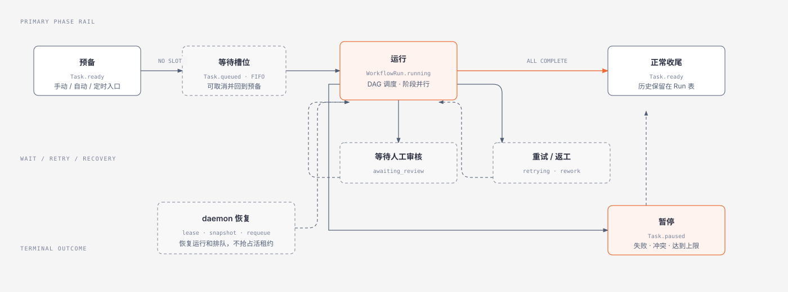
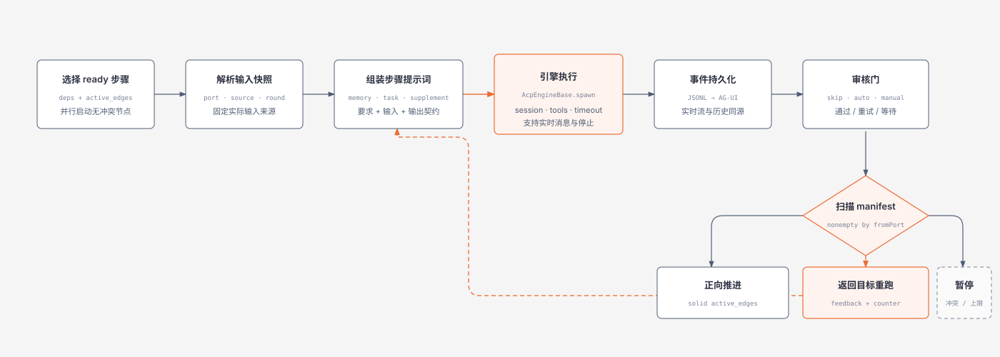
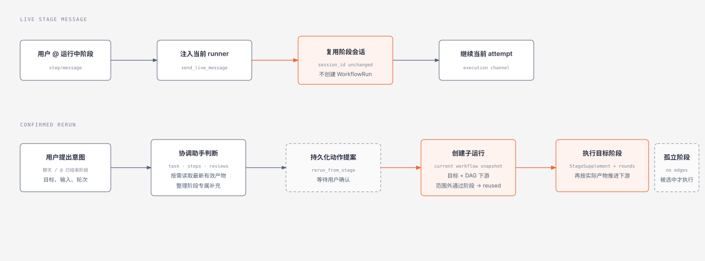

# 工作流引擎执行全景图

本页汇总任务生命周期、单阶段执行与产物路由，以及阶段消息和局部重跑。更完整的规则说明见[工作流引擎执行全景](../workflow-engine-execution.md)。

端口级分流和多输入等待另见 [A1/A2 与 B/C 依赖示例](artifact-port-fanout.svg)。

## 任务运行生命周期

## 单阶段执行与产物路由

## 阶段消息、协调助手与局部重跑

需要浏览器大图布局时，可打开 [HTML 版本](workflow-engine-execution.html)。
