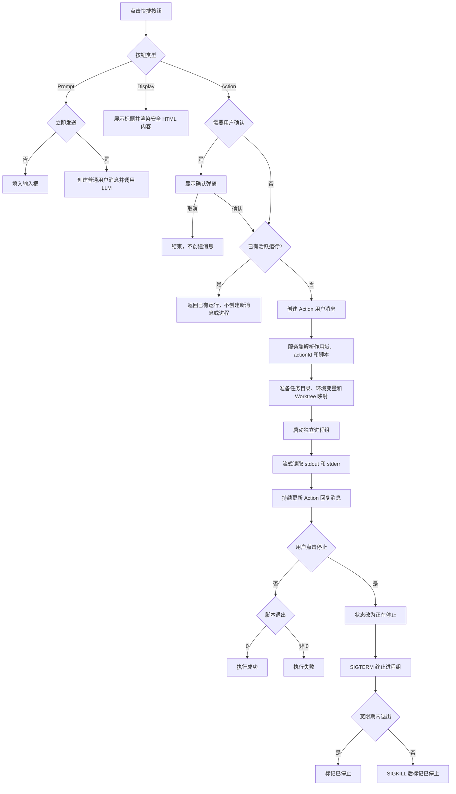

# 快捷按钮与 Action 执行方案

> 状态：首版已实现。项目/阶段配置、脚本选择与预览、任务/项目聊天执行、确认、停止、去重、运行记录和任务 Worktree 新目录已接入。运行状态目前由页面轮询恢复，服务端同时发布 Action 事件；`action.json` 为可选的运行参数文件，入口脚本由快捷按钮配置指定。

## 1. 目标

把聊天输入框上方的快捷按钮扩展为三种类型，并允许项目或流程提供可直接运行的 Action。Action 不经过 LLM，点击后立即创建结构化消息、异步执行脚本、流式回填输出，并允许用户停止整个进程组。

快捷按钮类型：

- `prompt`：标题、文本、是否立即发送；未立即发送时只填入输入框。
- `display`：分别配置标题和 HTML 内容；输入框上方展示标题并渲染经过白名单清洗的内容，不触发消息。
- `action`：引用一个 Action，直接执行并产生专用消息。

## 2. 配置入口与继承

### 项目级

项目设置增加“快捷按钮”页签，沿用现有左侧列表、右侧配置的布局。项目按钮在项目聊天中全局可用，也可以被流程继承。

项目 Action 位于：

```text
.workstep/actions/<action_id>/
├── action.json
└── scripts...
```

### 流程与阶段级

流程编辑页右侧的“快捷按钮”入口与项目设置共用左侧列表、右侧配置的编辑界面，用于创建本流程所有任务可用的按钮；同一界面列出项目级按钮，可逐个勾选是否沿用。所选项目按钮 ID 保存在 `projectQuickButtonIds`，流程自有按钮保存在顶层 `quickButtons`。旧流程没有选中列表时继续按原 `inheritProjectQuickButtons` 开关兼容读取：未关闭则默认使用全部项目按钮。阶段编辑面板的“快捷按钮”分区维护当前阶段的本地按钮，不在阶段内配置项目级继承。阶段按钮存入对应流程节点，仅在任务处于该阶段时展示。

同一流程的 Action 脚本由所有阶段和任务共享：

```text
.workstep/artifacts/<workflow_id>/actions/<action_id>/
├── action.json
└── scripts...
```

显示顺序固定为阶段按钮、流程按钮、继承的项目按钮；按稳定 ID 区分，不按标题去重。

## 3. 任务目录和 Git Worktree

```text
.workstep/artifacts/<workflow_id>/
├── actions/<action_id>/
└── <task_id>/
    ├── <step_key>/<round>/
    ├── .worktrees/<alias>/
    ├── .worktrees.json
    └── .action-runs/<run_id>/
```

Action 支持三种执行目录：

- `project`：项目根目录。
- `task`：`.workstep/artifacts/<workflow_id>/<task_id>/`。
- `worktrees`：进程仍从任务目录启动，通过环境变量把所有 Worktree 交给脚本，由脚本选择一个或多个仓库。

流程级 Action 默认选择 `task`。项目级 Action 在任务聊天中也默认选择 `task`，可显式改为 `project` 或 `worktrees`。

后端使用现有任务 Worktree 元数据生成 `.worktrees.json`，内容包含 `repository_id`、名称、alias、分支和绝对路径。脚本不得根据动态分支名猜路径。

运行时注入：

```text
WORKSTEP_PROJECT_ROOT
WORKSTEP_WORKFLOW_ROOT
WORKSTEP_TASK_ROOT
WORKSTEP_ACTION_ROOT
WORKSTEP_WORKTREES_FILE
WORKSTEP_PROJECT_ID
WORKSTEP_WORKFLOW_ID
WORKSTEP_TASK_ID
WORKSTEP_STEP_KEY
WORKSTEP_ACTION_RUN_ID
```

新建 Worktree 使用任务目录下的新位置；旧 `.workstep/worktrees/<task_id>/` 只做兼容解析，不自动搬迁，因为 Git 已记录绝对路径。

## 4. 数据结构

```ts
type QuickButtonType = 'prompt' | 'display' | 'action'
type ActionCwdMode = 'project' | 'task' | 'worktrees'

interface QuickButton {
  id: string
  type: QuickButtonType
  title: string
  text?: string
  content?: string // display 的 HTML 内容
  immediateSend?: boolean
  actionId?: string
  scriptPath?: string
  cwdMode?: ActionCwdMode
  requireConfirmation?: boolean
}

interface WorkflowQuickButtonSettings {
  projectQuickButtonIds: string[]
  quickButtons: QuickButton[]
  nodes: Record<string, QuickButton[]>
}
```

旧按钮缺少 `type` 时按 `prompt` 读取，`immediateSend` 默认为 `false`。

`scriptPath` 保存相对于 Action 根目录的脚本文件路径，例如 `scripts/restart-services.sh`。项目、流程和阶段的 Action 配置区均提供：

- 只读的脚本路径输入框和“选择…”按钮。
- 点击“选择…”打开项目通用目录浏览器，并限制根目录为当前 Action 目录；浏览器扩展单文件选择模式和 `onSelectFile` 回调。
- 已选择脚本后显示“预览”按钮，直接打开通用 `ProjectDirectoryBrowser`，根目录仍锁定在当前 Action 目录并定位该文件；默认沿用其文件预览，用户可切换既有的编辑模式（`ProjectDirectoryFileEditor`）修改脚本并保存。不要为 Action 再实现独立预览弹框或编辑器。
- “执行前需要用户确认”复选框，默认开启；明确无副作用且需要一键执行的 Action 可以关闭。

首版以快捷按钮的 `scriptPath` 作为入口；可选的 `action.json` 声明 Action ID、解释器、参数、超时和停止宽限期。快捷按钮引用 Action，并配置入口与确认策略。客户端只提交按钮 ID 和任务上下文；后端重新解析 Action，不接受客户端直接传入任意命令、绝对脚本路径或 PID。

## 5. 消息与执行流程



Action 回复消息显示标题、来源、实际工作目录、运行状态、实时日志、运行时长和退出码。仅在运行中显示停止按钮；停止请求按 `action_run_id` 查找后端持有的进程，不接受任意 PID。重复停止必须幂等。

确认弹窗复用 `ConfirmDialog`，显示 Action 标题、脚本相对路径、执行目录和当前任务。取消确认不创建消息、不生成运行记录；确认后才请求执行。运行接口读取服务端保存的 `requireConfirmation`，需要确认时要求请求携带 `confirmed: true`，避免普通调用方误触发。

脚本启动的子服务必须保留在当前进程组内。使用 `nohup`、双重 fork 或其它脱离进程组的方式后，停止按钮无法保证回收服务，生成脚本时应明确禁止。

## 6. 接口与实时事件

```text
POST /api/projects/{project_id}/actions/{action_id}/directory
GET  /api/tasks/{task_id}/actions
POST /api/tasks/{task_id}/actions/run
GET  /api/project-actions/sessions/{session_id}
POST /api/project-actions/sessions/{session_id}/run
GET  /api/action-runs/{run_id}
POST /api/action-runs/{run_id}/stop
```

WebSocket 事件：

```text
action_run_started
action_run_output
action_run_stopping
action_run_completed
action_run_failed
action_run_stopped
```

页面刷新后通过运行记录恢复输出、状态和停止按钮；首版页面进入时读取一次，只在 Action 活跃期间每 1.2 秒轮询，结束后停止，服务端也发布上述事件供后续统一事件消费。Daemon 重启后无法继续控制的进程记录在首次读取时标记为“执行中断”，不得继续展示可用的停止按钮。

## 7. 同一 Action 的并发保护

同一个任务内，同一个 `action_id` 同时只能存在一个活跃运行：`preparing`、`running` 或 `stopping`。不同任务可以各自运行同一 Action；项目聊天没有任务上下文时，以 `project_id + action_id` 作为唯一范围。

- 前端在收到 `action_run_started` 后立即禁用对应快捷按钮，显示旋转状态和“执行中”；页面刷新或重新进入任务后按活跃运行记录恢复禁用状态。
- 后端在创建进程前以 `active_key` 原子占位，值为任务范围加 Action ID；活跃记录的 `active_key` 使用唯一约束，终态记录清空该字段。
- 同时到达的重复请求只会有一个创建运行记录和子进程；后续请求返回已有的 `run_id` 与 `deduplicated: true`，前端定位/订阅已有消息，不新增用户消息或回复消息。
- 确认弹窗提交时也检查活跃记录；若已经运行，关闭弹窗并显示已有运行态，不执行第二次。
- 成功、失败、已停止、超时和执行中断后才解除禁用，允许再次点击执行。

## 8. 安全与边界

- 所有 Action、任务和 Worktree 路径都进行 `resolve`、目录包含关系和符号链接检查。
- 脚本选择器只能返回 Action 根目录内的普通文件；数据库只保存相对路径，预览和执行时都由服务端重新校验，拒绝绝对路径、`..`、目录和越界符号链接。
- 默认以参数数组启动子进程，不拼接 shell 字符串；确需 shell 时由受信任的 `action.json` 明确声明解释器。
- `display` 标题经过 HTML 白名单清洗，禁止脚本、事件属性、iframe 和外部资源。
- 产物扫描忽略流程下保留的 `actions/` 以及任务下所有点号目录；`actions` 为流程目录的保留名称。
- 子进程 stdout/stderr 使用分块异步读取，文件和运行日志 I/O 不得阻塞事件循环。

## 9. 验收与测试

- 三种按钮切换后只显示对应配置；类型控件保持普通表单尺寸。
- 选择脚本时浏览器根目录锁定在 Action 目录，选中后正确回填相对路径；存在脚本时“预览”会打开通用文件目录组件，并可进入其既有编辑模式修改、保存后再次预览。
- 开启执行确认后，点击按钮先出现确认弹窗；取消时没有消息和运行记录，确认后才执行。关闭该选项时直接执行。
- 同一任务内双击、快速连点、多个浏览器标签页并发调用同一 Action 时，只创建一个 `action_run` 和一个子进程；其它请求返回同一运行记录。
- 活跃运行期间快捷按钮始终禁用，停止、完成、失败、超时后才重新可用；刷新页面后状态一致。
- 在流程编辑页右侧“快捷按钮”逐个勾选项目级按钮后，该流程全部任务只显示勾选的项目按钮；阶段本地按钮不受影响。
- 同一流程 Action 在不同任务、不同分支下读取各自的 Worktree 映射。
- 一个脚本可根据 `.worktrees.json` 启动两到三个仓库中的服务。
- stdout/stderr 持续回填同一条 Action 回复，成功、失败、超时状态正确。
- 点击停止后脚本及其未脱离进程组的子服务全部退出，历史输出保留。
- 慢文件、慢子进程输出和 SQLite 锁竞争期间，健康检查与 WebSocket 仍能及时响应。
- 页面刷新恢复运行态；Daemon 重启把遗留运行记录收敛为“执行中断”。
