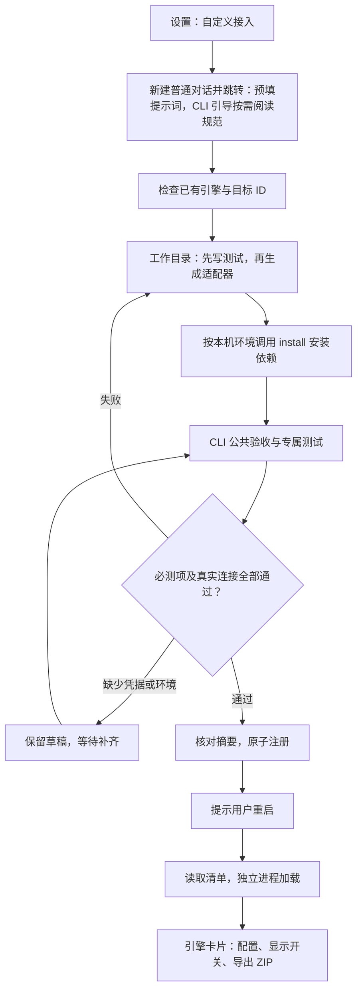
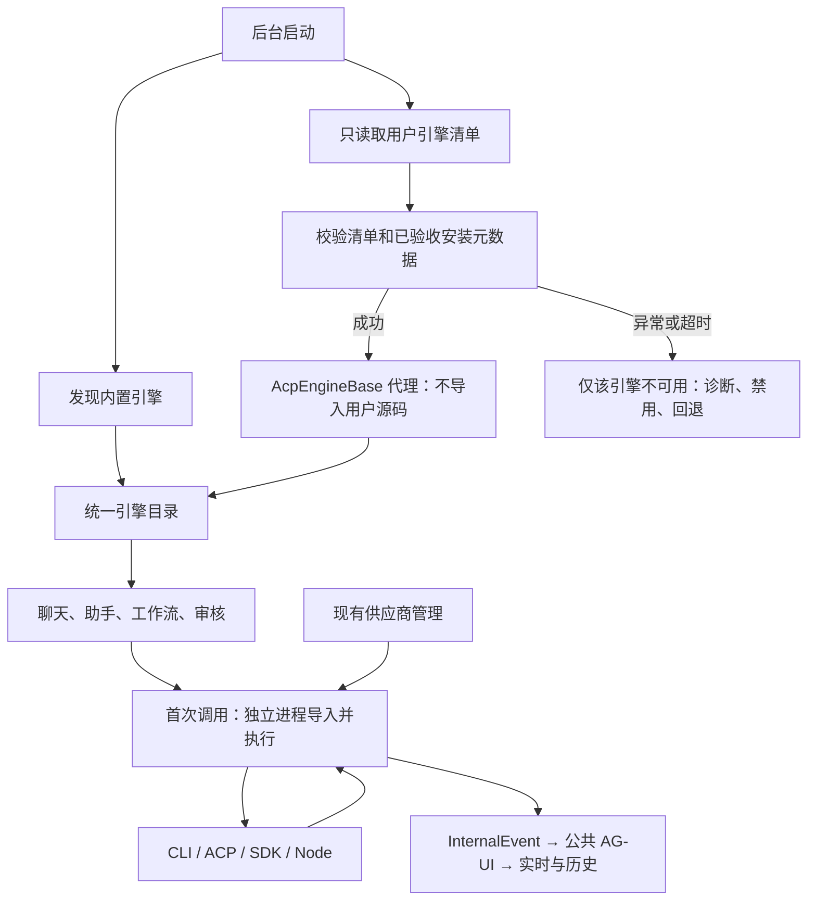

# WorkStep 自定义引擎接入方案

状态：已实施，核心流程已通过本机行为回归。CLI 引擎恢复与显示开关、自定义普通对话入口、内置 Skill、独立进程、依赖安装、公共验收、注册及 ZIP 导出已落地。

## 目标与入口

设置 → 执行引擎增加「自定义接入」按钮，复用普通新建对话并跳转，补充提示词，由 workstep-cli 按需引导阅读接入规范与接口契约，不加载独立技能。不新增专用聊天弹框、助手、store 或 WebSocket 通道。提示词包含目标工作目录、已有引擎检查、配置与供应商约定、安装与验收命令。首版支持 ACP、CLI、Python SDK 及 Node 桥接，适配器采用统一 AcpEngineBase 接口。

## 接入流程

## 目录、安装与导出

根目录为 $WORKSTEP_CONFIG_DIR/runtime，默认 ~/.workstep/runtime。草稿位于 engine-workspaces/<草稿ID>，正式引擎位于 engines/<引擎ID>，每个引擎包含 engine.py、manifest.json、tests、resources、dependencies、cache、validation.json。容器有项目根目录限制时，草稿放在允许的项目根目录 workstep-engine-workspaces/<草稿ID>，正式引擎目录仍在 runtime。

引擎可实现自定义 install，接收 WorkStep 分配的安装目标目录以及操作系统、CPU 架构、Python 版本、已有运行时等环境信息。依赖安装到 dependencies，下载缓存放 cache；公共 Python/Node 基础运行时可以复用，专属依赖隔离。Python 适配器可以调用 Python SDK、CLI、Node SDK 或 ACP，不要求下游必须有 Python SDK。导入阶段不得因专属 SDK 尚未安装而失败，专属依赖在安装后按需加载。

安装和更新先使用临时目录；验证真实版本、导入或程序启动成功后切换，失败保留旧环境。不修改 daemon 自身环境、项目依赖或现有内置引擎的共享安装目录。

引擎卡片提供导出 ZIP。使用明确文件白名单，仅打包适配代码、清单、测试、必要桥接资源和脱敏验收报告；不导出 dependencies、cache、密钥、认证文件、配置值或日志。平台条件与依赖版本由源码 install 和包内说明声明，目标机器重新调用 install 并验收。首版可解压后用 CLI 注册目录，不新增 ZIP 导入界面。应用升级与基础运行时清理必须保留用户引擎。

## 公共 CLI 与验收

提供 engine inspect <路径>、validate <路径>、register <路径>、export <ID> --output <ZIP>、disable <ID>。inspect 接受 Python 文件或目录，区分运行时已安装与适配器已注册；重复 ID 的更新需明确处理，禁止覆盖内置 ID。disable 用于故障隔离，与仅控制下拉显示的开关分开。

CLI 通过已有认证传输调用共享后台服务，接入助手复用同一服务。长操作支持查询、取消、幂等处理及结构化 JSON 报告。公共验收随安装包分发，不依赖源码仓库完整测试环境，也不能只相信助手生成的测试或 install 的成功返回。

公共验收覆盖：身份和接口版本、接口存在性与 spawn 签名、配置与敏感字段、能力声明、实际事件形状、工具 ID/状态、用量、统一 AG-UI 翻译、停止与重复停止、会话与分叉，以及绑定供应商/模型下的真实调用。执行→下游→审核为公共引擎接口的真实调用链探测，不在用户项目创建任务或改写流程。可选能力按声明要求真实场景，无来源不伪造事件，不支持时测试安全降级。专属 unittest 用于验证原生样例映射，真实探测另行记录。完整服务层集成由仓库回归覆盖，包括新建普通对话的真实数据库 API、重启后的真实 TaskRunner 执行/下游，以及主进程响应 canary。

报告逐项记录通过、失败、不适用、未执行，包含适配器摘要、依赖版本、接口版本和相关配置指纹（不保存明文密钥）。代码、依赖或相关配置变化使报告失效。只有必测项、声明能力及真实连接全部通过才能注册。完成状态由后台判定；缺少凭据、环境或网络不能冒充通过。停止后终止本次操作进程树并保留草稿，注册完成后才提示用户重启。

## 发现、隔离与供应商

主进程不导入用户代码，启动不等待探测。工作进程使用独立环境和与 WorkStep 同版本的可导入适配接口；桌面编译后台也须分发该接口及 worker 入口。代理以带版本与请求 ID 的 JSONL 协议转发执行、会话、审批、配置、模型及能力方法，stdout 专用于协议，诊断走 stderr，使用现有分块读取器。加载和管理请求有超时，执行复用取消与空闲超时，故障转为标准错误，清理进程树，不无限自动重启。提供跳过全部自定义引擎的启动恢复开关；更新在重启后生效，不热替换活跃会话。独立进程提供崩溃隔离，不宣称恶意代码权限隔离；沙箱模式在容器内部安装和执行。

引擎使用 config_schema 声明自身选项，供应商配置与密钥沿用现有服务。通过 supported_provider_protocols 匹配预设/自定义供应商，通过 build_provider_runtime 真正注入地址、凭据和模型；provider_required/build_native_runtime 控制原生登录。首版复用已有协议，私有协议采用适配器专属配置，受管模式遵守现有授权。

## 内置引擎显示开关（本批实现）

恢复 Codex CLI（codex）与 Claude Code CLI（claude）注册。设置 → 执行引擎每张卡片增加「在选择列表中显示」开关；两款 CLI 默认关闭，其他引擎默认开启。显示状态持久化为 engine_visibility，目录返回 enabled。

关闭的引擎不出现在任何可选下拉或菜单中，但不会注销引擎、清除配置、取消任务或禁止执行。已有步骤、审核、会话及默认配置继续按原引擎运行。当前选择值可以保留显示，隐藏为不可重新选择的 option，不能因关闭自动改写原值。设置页始终显示全部引擎卡片，支持重新开启；共享状态即时通知聊天、步骤和画布。

## 实施及验收

顺序：公共 CLI/验收 → worker 与代理 → 外部发现及安装 → Skill/普通对话入口 → ZIP 导出与卡片管理。先测试后实现。

回归覆盖：导入异常、永久阻塞、进程退出、非法协议、超长事件、执行崩溃、安装中断、报告失效；这些情况下后台仍启动、健康检查响应且其他引擎可用。验证普通对话会话恢复和现有助手回归。显示开关覆盖默认值、持久化、实时隐藏/恢复、已有选择不变以及关闭后仍可创建执行实例；慢配置写入配健康检查 canary。

实际安装包验证 macOS/Windows/Linux 的编译后台外部导入、依赖安装、权限、重启发现和升级保留，另测沙箱。未测试平台记录缺口。更新 docs/code-map.md、引擎开发指南和运行时规范；在 dev 合并 main 的交付节点集中同步手册及固定演示环境截图，运行官网测试、构建及 manual:check。本批不自动提交、合并或推送。

## 本批验证结果与缺口

- 已验证普通对话预填、显示开关、ZIP 下载与运行停用；公开 API 的安装/验收/注册/导出流程，报告篡改与代码/配置变化拒绝，未声明源码拒绝，安装及原子切换失败恢复旧环境。
- 已用真实子进程覆盖导入异常、阻塞、退出、实时消息队列和会话初始化；停止验收拒绝无法结束活跃流的引擎，主进程 canary 及子进程树清理通过。
- 已通过本地 wheel（无网络）验证无 pip 的 uv 环境可安装专属 Python SDK，依赖只进入本引擎目录。已验证新 Python 进程自动发现并通过真实 TaskRunner 执行执行→下游流程。
- 本机为 macOS 源码运行环境。尚未执行 macOS/Windows/Linux 最终桌面包的安装、升级保留及沙箱实测；实际第三方 SDK、Node 运行时下载与真实供应商连接由用户选定引擎后执行公共验收，本批测试不使用真实供应商密钥。
- Web 全量回归出现一项本批引擎改动之外的工作流快捷按钮复选框数量断言失败；引擎相关前端行为测试与构建通过。
- 手册及演示截图按项目约定，在 dev 合并 main 的交付节点集中同步。本批未提交、合并或推送。
